# Data Processing with Data Refinery

In this module, we will prepare our data assets for analysis. We will use the `Data Refinery` graphical flow editor tool to create a set of ordered operations that will cleanse and shape our data. We will also explore the graphical interface to profile data and create visualizations to get a perspective and insights into the dataset.

This section is broken up into the following steps:

1. [Merge and Cleanse Data](#merge-and-cleanse-data)
1. [Profile Data](#profile-data)
1. [Visualize Data](#visualize-data)

> **Note:** You can click on any image in the instructions below to zoom in and see more details. When you do that just click on your browser's back button to return to the previous page.

> **Note:** The lab instructions below assume you have completed the setup section already, if not, be sure to complete the setup first to create a project and a deployment space.

## Merge and Cleanse Data

We will start by wrangling, shaping and refining our data. To do this, we will create a refinery flow to contain a series of data transformation steps.

* Go the (☰) navigation menu, expand `Projects` and click on the project you created during the setup section.

  

* To create a data refinery flow, click the `Add to project` button from the top of the page and click the `Data Refinery flow` option.

  [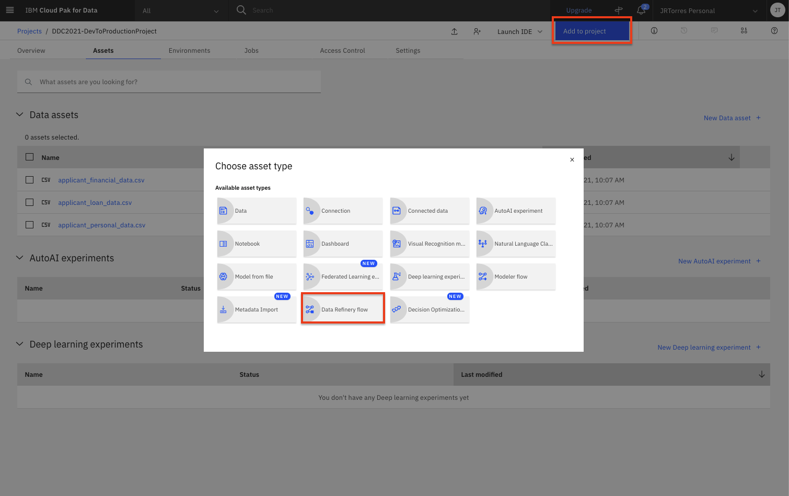](../images/dr/dr-create-flow.png)

* Select `Data assets` on the left panel, then select the `application_loan_data.csv` data asset. Then click the `Add` button.

  [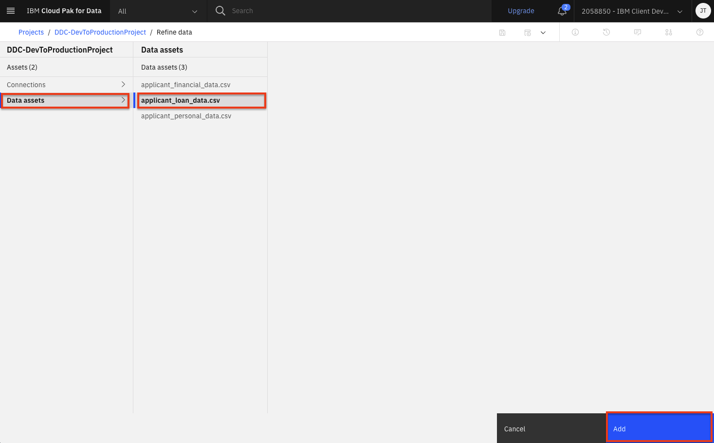](../images/dr/dr-flow-add-asset.png)

* The first thing we want to do is create a merged dataset. Start by joining the loan data with information about the loan application. Click the `Operation` button on the top left and then scroll down and select the `Join` operation.

  [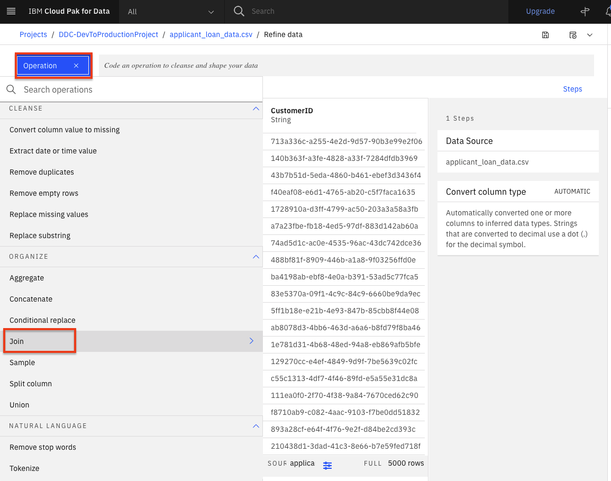](../images/dr/dr-flow-join-operation.png)

* From the drop down list, select `Inner join` and then click the `Add data set` link to select the data asset you are going to join with.

  [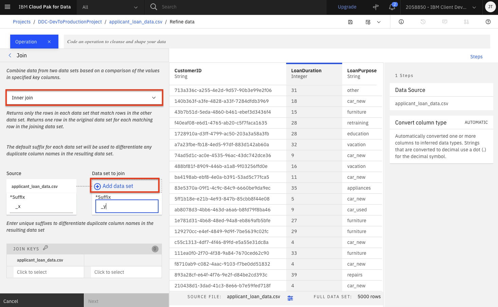](../images/dr/dr-flow-join-params1.png)

* Select `Data assets` on the left panel and this time select the `application_personal_data.csv` data asset. Then click the `Apply` button.

  [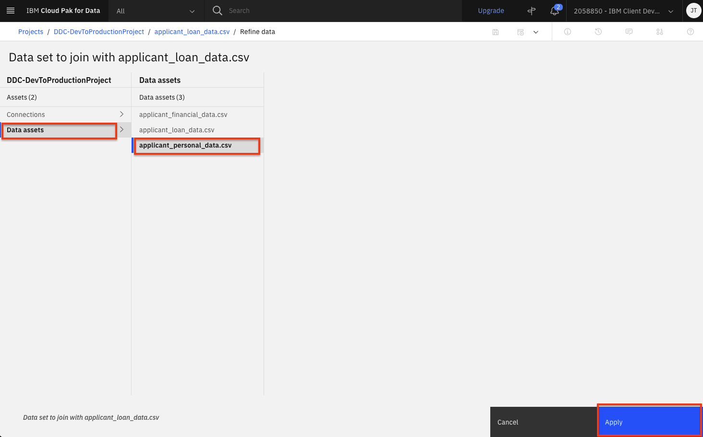](../images/dr/dr-flow-join-select-second-asset.png)

* Finish setting the following values and then click the `Next` button:

  * Under the `Source` `*Suffix` option, enter `_loan_ds`.
  * Under the `Data set to join` `*Suffix` option, enter `_personal_ds`.
  * Under the Join keys, click the input box and select `CustomerID` for both data sets.

    [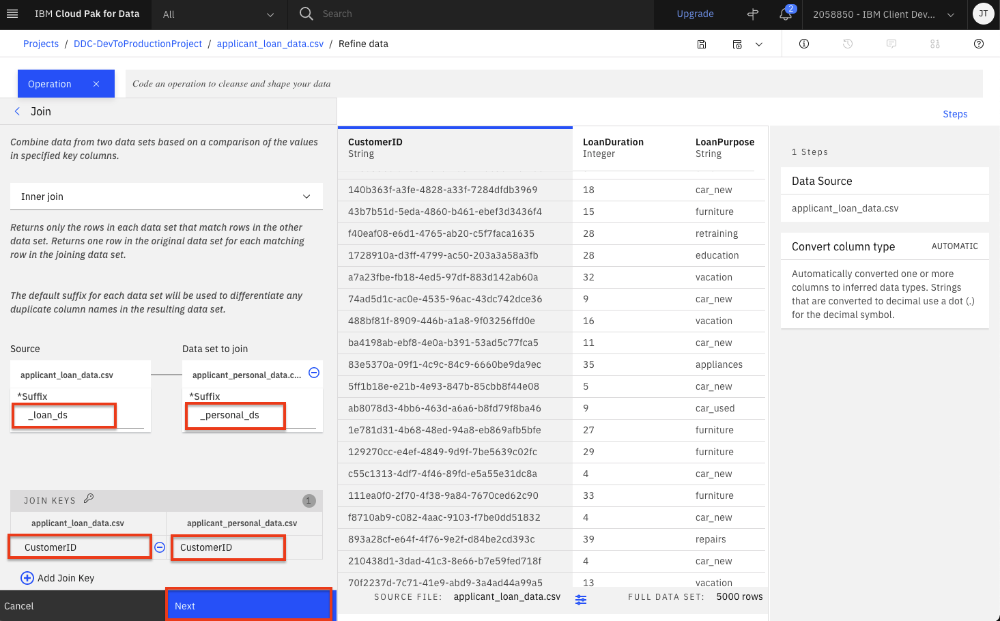](../images/dr/dr-flow-join-params2.png)

* Although we could modify what columns will be in the joined dataset, we will leave the default and include them all. Click the `Apply` button.

  [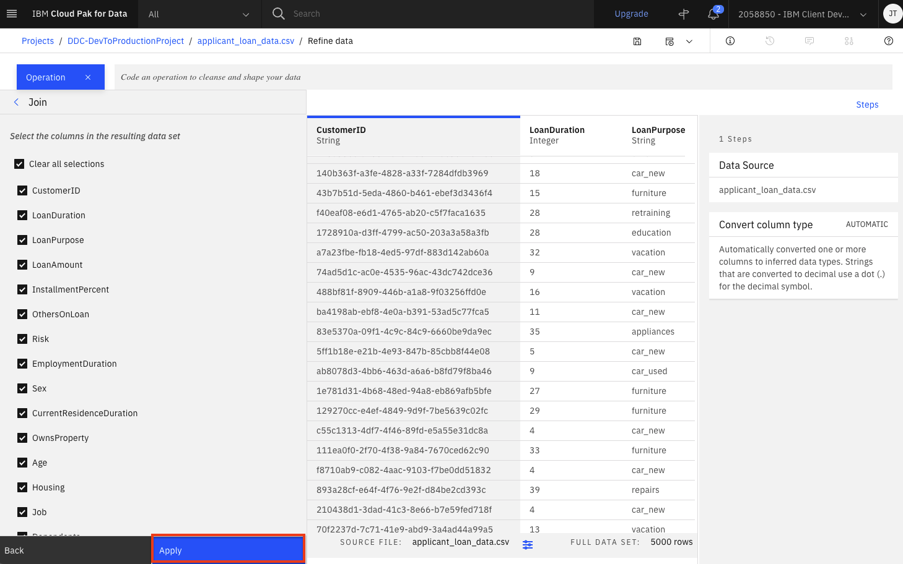](../images/dr/dr-flow-join-apply.png)

* Repeat the five previous steps to join our other dataset (i.e the financial information for this applicant). Click the `Operation` button on the top left and then scroll down and select the `Join` operation. Set the following values and then click the `Next` button:

  * Inner join
  * Data set to join: `application_financial_data.csv`
  * Under the `Source` `*Suffix` option, enter `_loan_ds`.
  * Under the `Data set to join` `*Suffix` option, enter `_financial_ds`.
  * Under the Join keys, click the input box and select `CustomerID` for both data sets.

    [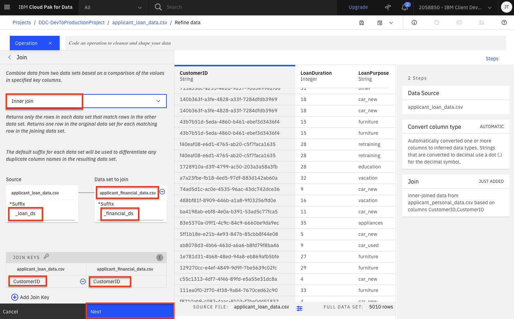](../images/dr/dr-flow-join-2.png)

* Click the `Apply` button to finish this final join.

* Let's say we've decide that there are columns that we don't want to leave in our dataset ( maybe because they might not be useful features in our Machine Learning model, or because we don't want to make those data attributes accessible to others, or any other reason). We'll remove the `FirstName`, `LastName`, `Email`, `StreetAddress`, `City`, `State`, `PostalCode` columns. For each column to be removed:

  * Click the `Operation +` button, then select the `Remove` operation.
  
    [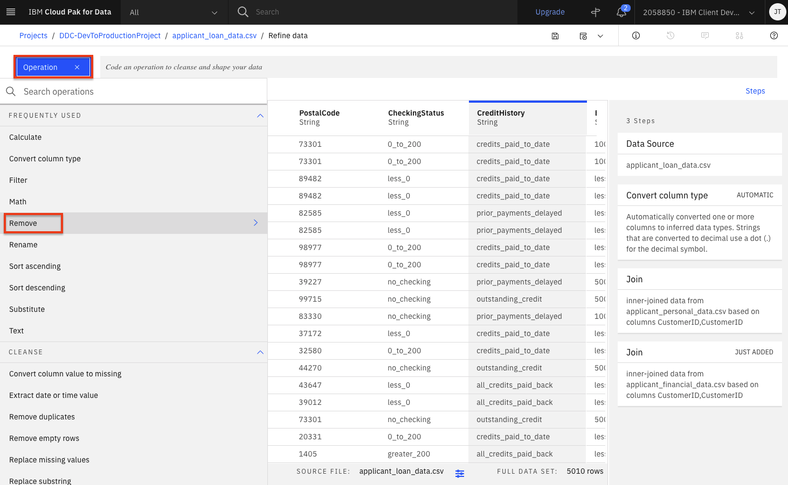](../images/dr/dr-flow-remove-operation.png)

  * In the `Select column` drop down, choose one of the columns to remove (i.e `FirstName`). Click the `Next` button and then the `Apply` button.
  
    [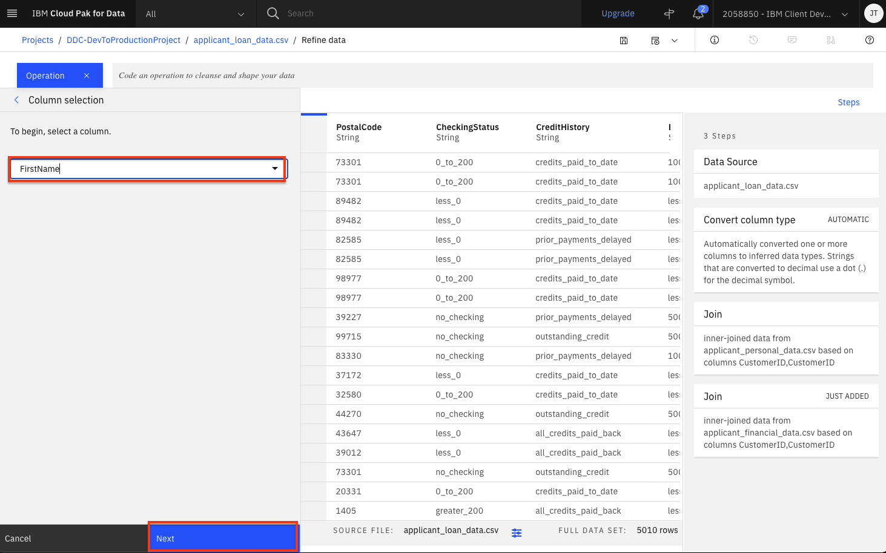](../images/dr/dr-flow-remove-select-column.png)
  
  * The column will be removed. Repeat the above two steps to remove the remaining six columns.

* Finally, we want to ensure there is no duplicates in our dataset. Click the `Operation` button once again and click the `Remove duplicates` operation.

  [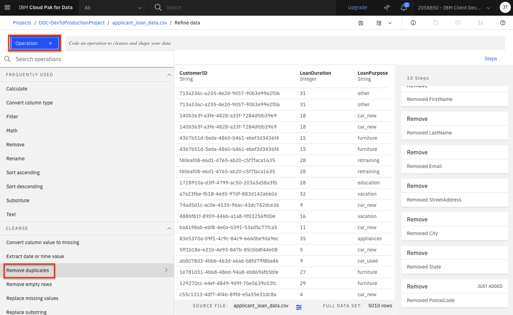](../images/dr/dr-flow-remove-duplicates.png)

* Select `CustomerID` as the column and click the `Next` button. Then click the `Apply` button in the subsequent panel.

  [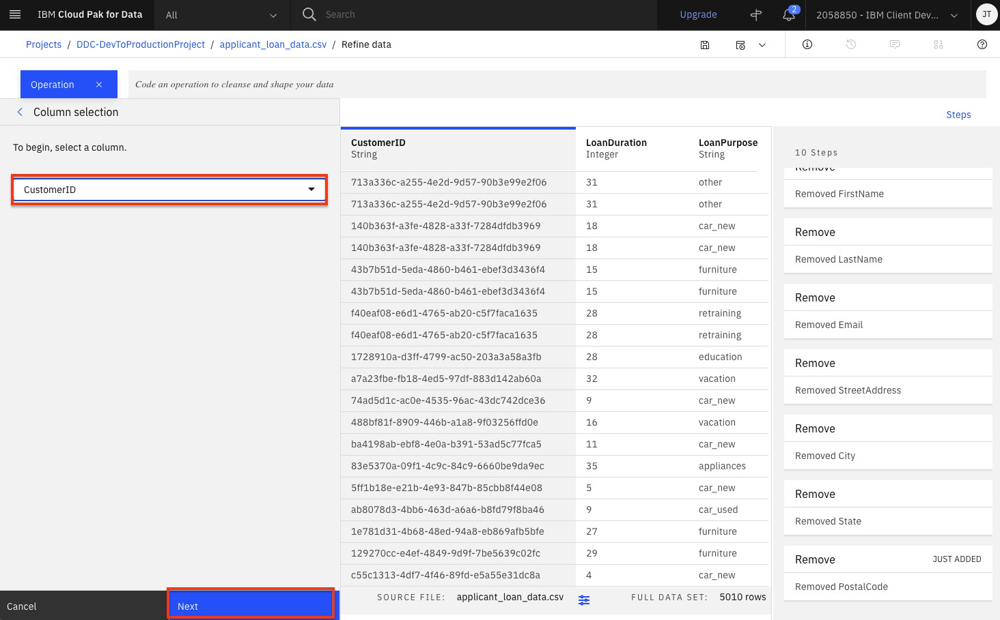](../images/dr/dr-flow-remove-duplicates-select.png)

* At this point, you have a data transformation flow with 11 steps. The flow keeps track of each of the steps and we can even undo (or redo) an action using the circular arrows. To see the steps in the data flow that you have performed, click the `Steps` button. The operations that you have performed on the data will be shown.

  [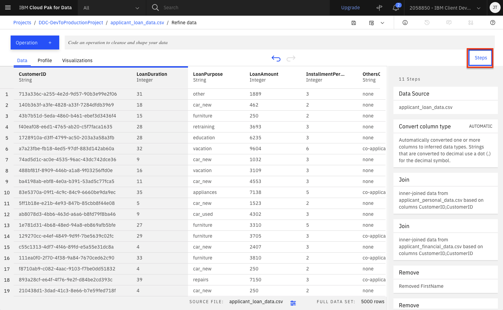](../images/dr/dr-final-flow.png)

* You can modify these steps and/or save for future use. Lets edit the flow name and output options. Click on the `Information` icon on the top right and then click the `Edit` button.

  [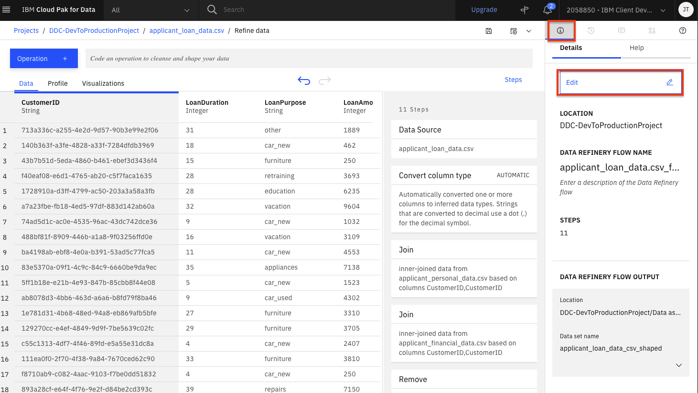](../images/dr/dr-flow-edit-information.png)

* Click the pencil icon next to `Data Refinery Flow Name`, set the name to `credit_risk_wrangling_cleaning_flow` and click the `Apply` button. Then click the `Edit Output pencil icon` and set the name to `credit_risk_shaped` (leave the rest of the CSV output defaults) and click the 'Check mark icon'. Finally, click the `Done` button

  [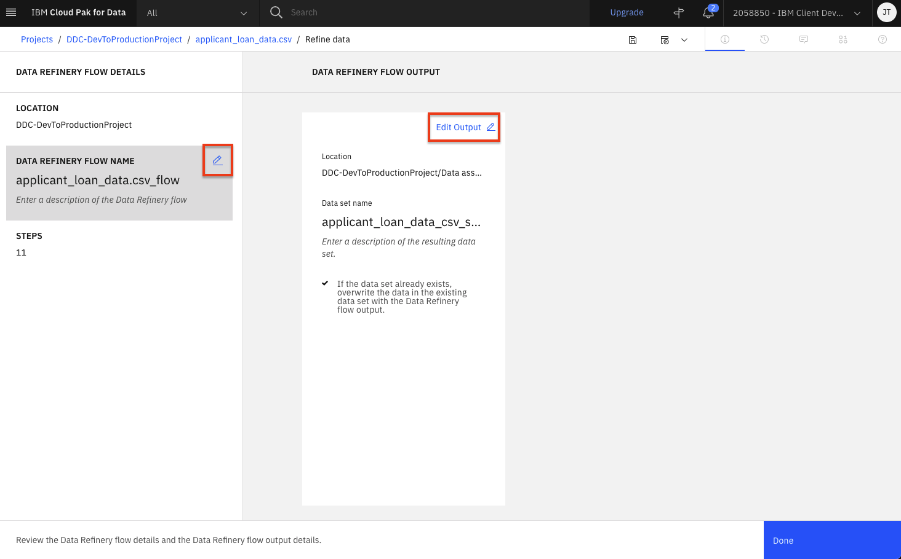](../images/dr/df-flow-edit-information-inputoutput.png)

* Click the `Save` icon to save the flow.

  [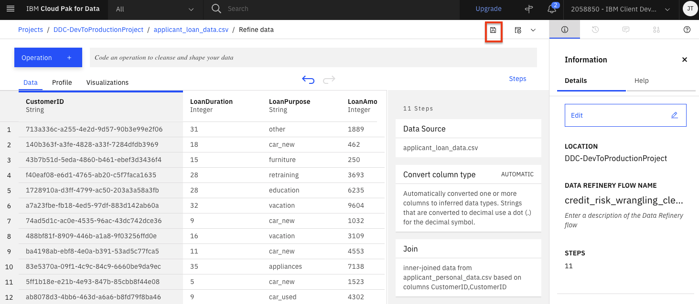](../images/dr/dr-flow-save.png)

### Run Data Flow Job

Data Refinery allows you to run these data flow jobs on demand or at scheduled times. In this way, you can regularly refine new data as it is updated.

* Click on the `Jobs` icon and then `Save and create a job` option from the menu.

  [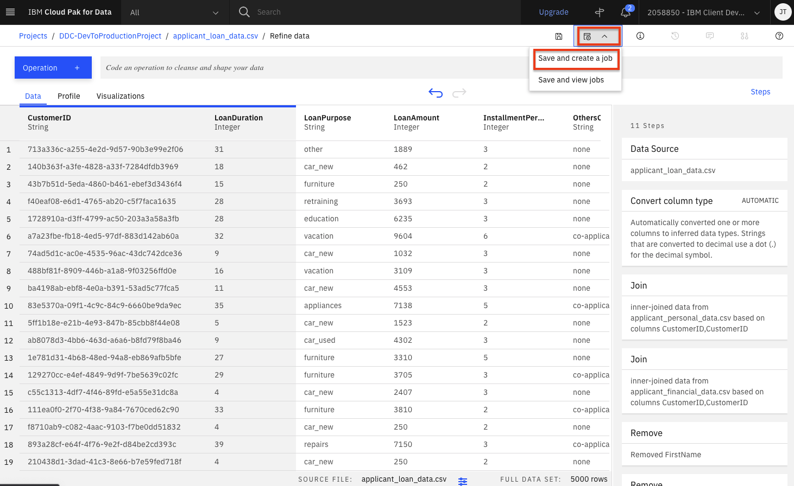](../images/dr/dr-job-save-and-create.png)

* Give the job a name and optional description. Click the `Next` button.

  [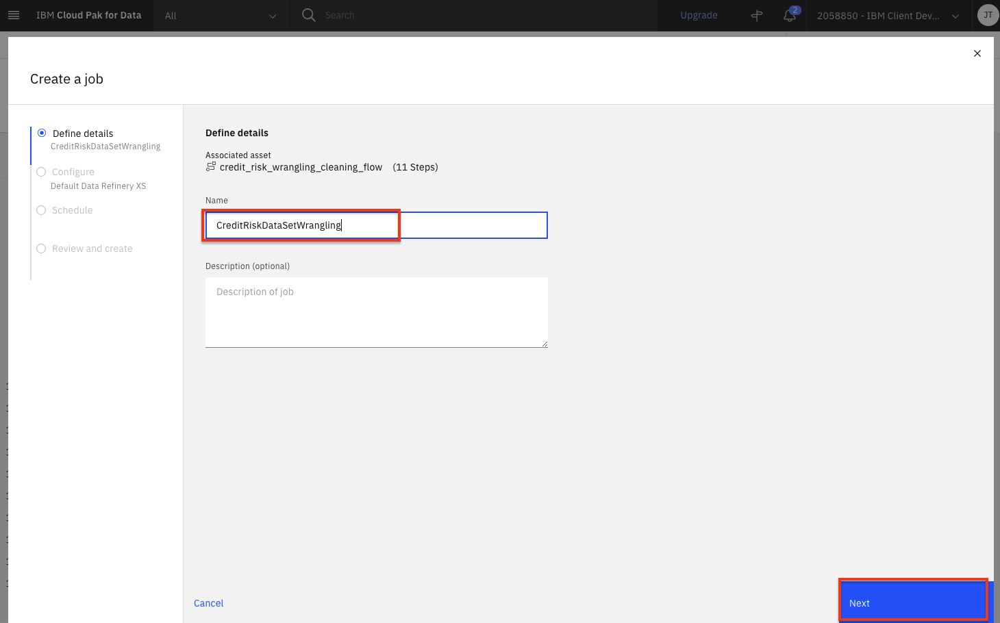](../images/dr/dr-job-name.png)

* Click `Next` on the next two screens, leaving the default selections. You will reach the `Review and create` screen. Note the output name, which is `credit_risk_shaped`. Click the `Create and run` button.

  [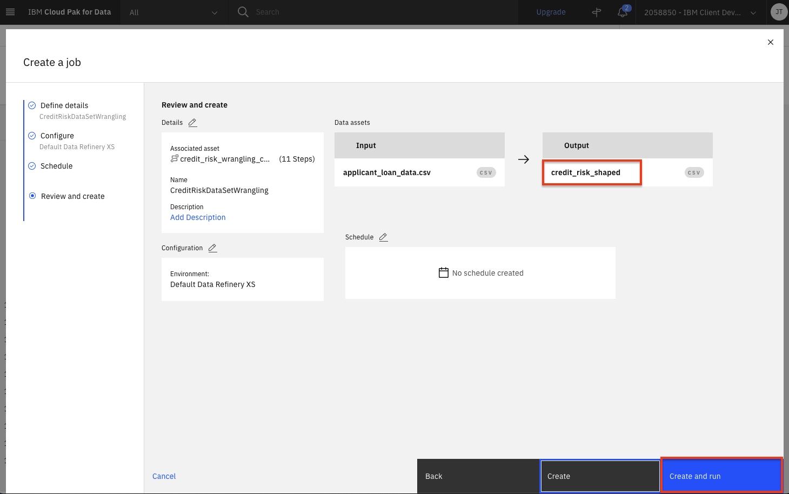](../images/dr/dr-job-create-and-run.png)

* When the job is successfully created, you will receive a notification. Click on the `job details` link in the notification panel to see the job status.

  [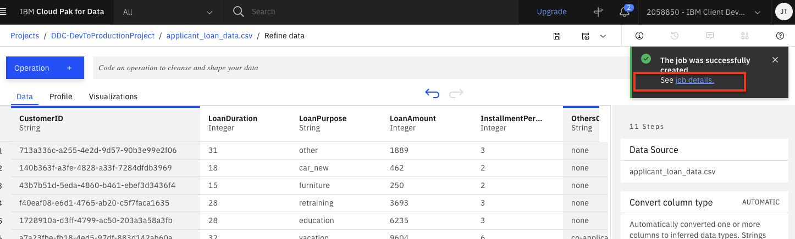](../images/dr/dr-job-notification-details.png)

* The job will be listed with a status of `Running` and then the status will change to `Completed`. Once its completed, click the `Edit configuration` button.

  [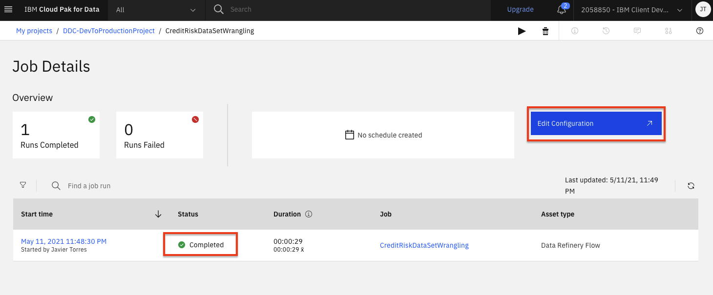](../images/dr/dr-job-completed-edit.png)

* Click the pencil icon next to `Schedule`.

  [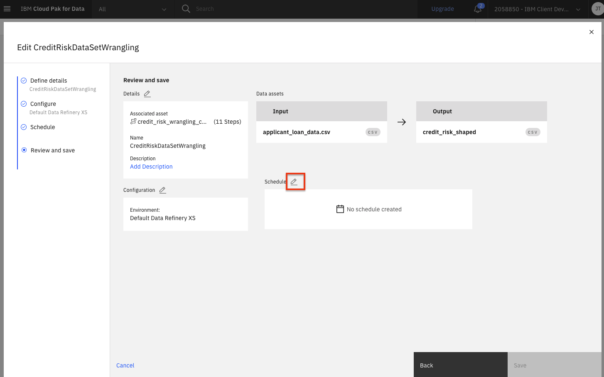](../images/dr/dr-job-schedule.png)

* Notice that you can toggle the *Schedule to run* switch and choose a date and time to run this transformation as a job. We will not run this as a job, so go ahead and click the `Cancel` link.

  [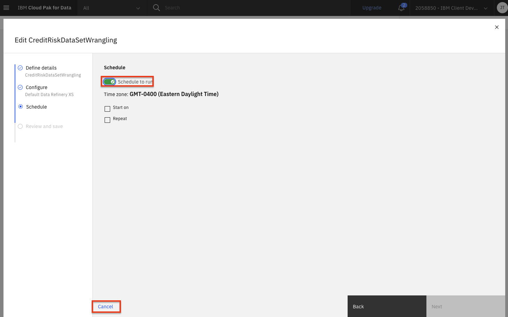](../images/dr/dr-job-schedule-settings.png)

## Profile Data

* Go back to the project by clicking the name of the project in the breadcrumbs in the top left area of the browser.

  [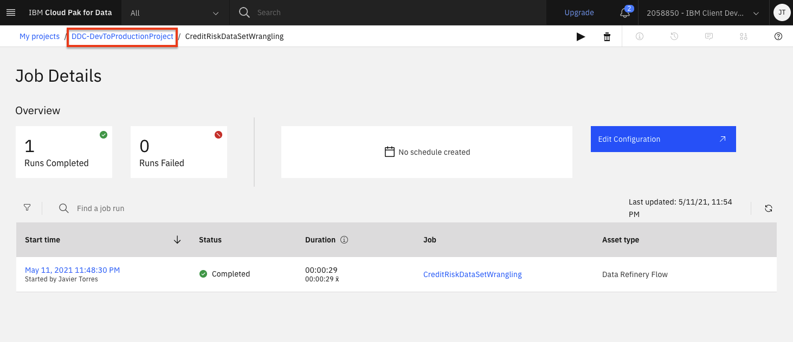](../images/dr/dr-back-to-project.png)

* Click the `Assets` tab and then scroll down to the `Data Refinery flows` section and click on the `credit_risk_wrangling_cleaning_flow` flow.

  [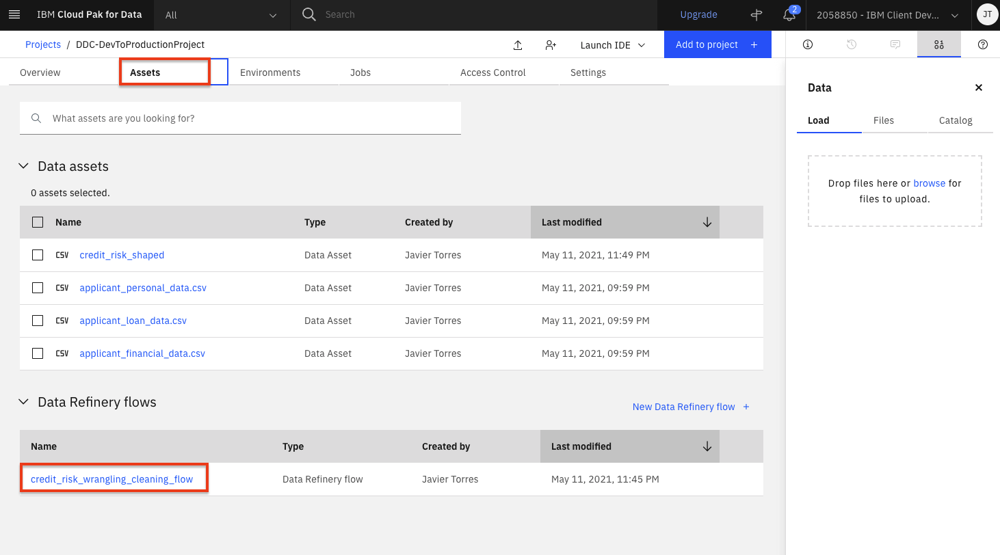](../images/dr/dr-flow-asset.png)

* Wait for the flow operations to be applied and then click on the `Profile` tab will bring up a view of several statistics and histograms for the attributes in your data.

  [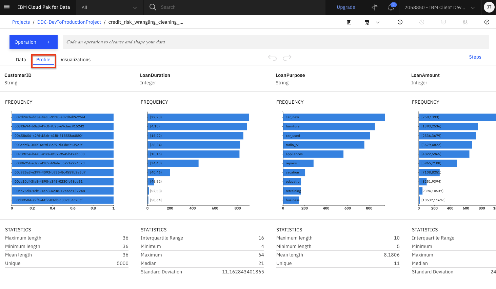](../images/dr/dr-profile.png)

* You can get insight into the data from the views and statistics:

  * The median age of the applicants is 36, with the bulk under 49.

  * About as many people had credits_paid_to_date as prior_payments_delayed. Few had no_credits.

  * Over three times more loan applicants have no checking than those with greater than 200 in checking.

## Visualize Data

Let's do some visual exploration of our data using charts and graphs. Note that this is an exploratory phase and we're looking for insights in out data. We can accomplish this in Data Refinery interactively without coding.

* Choose the `Visualizations` tab to bring up the page where you can select columns that you want to visualize. Add `LoanAmount` as the first column and click `Add Column` to add another column. Next add `LoanDuration` and click `Visualize`. The system will pick a suggested plot for you based on your data and show more suggested plot types at the top.

  

* Remember that we are most interested in knowing how these features impact a loan being at the risk. So, let's add the `Risk` as a color on top of our current scatter plot. That should help us visually see if there's something of interest here.

* From the left, click the `Color Map` section and select `Risk`. Also, to see the full data, drag the right side of the data selector at the bottom all the way to the right, in order to show all the data inside your plot.

  

* We notice that there are more risk (purple in this chart) on this plot towards the top right, than there is on the bottom left. This is a good start as it shows that there is probably a relationship between the riskiness of a loan and its duration and amount. It appears that the higher the amount and duration, the riskier the loan. Interesting, let's dig in further in how the loan duration could play into the riskiness of a loan.

* Let's plot a histogram of the `LoanDuration` to see if we can notice anything. First, select `Histogram` from the `Chart Type`. Next on the left, select `Risk` in the Split By section, select the `Stacked` radio button, and uncheck the `Show kde curve`, as well as the `Show distribution curve` options. You should see a chart that looks like the following image (move the bin width down to 1 if necessary).

  

* It looks like the longer the duration the larger the blue bar (risky loan count) become and the smaller the purple bars (non risky loan count) become. That indicate loans with longer duration are in general more likely to be risky. However, we need more information.

* We next explore if there is some insight in terms of the riskiness of a loan based on its duration when broken down by the loan purpose. To do so, let's create a Heat Map plot.
* At the top of the page, in the `Chart Type` section, open the arrows on the right, select `Heat Map` (accept the warning if prompted).

  [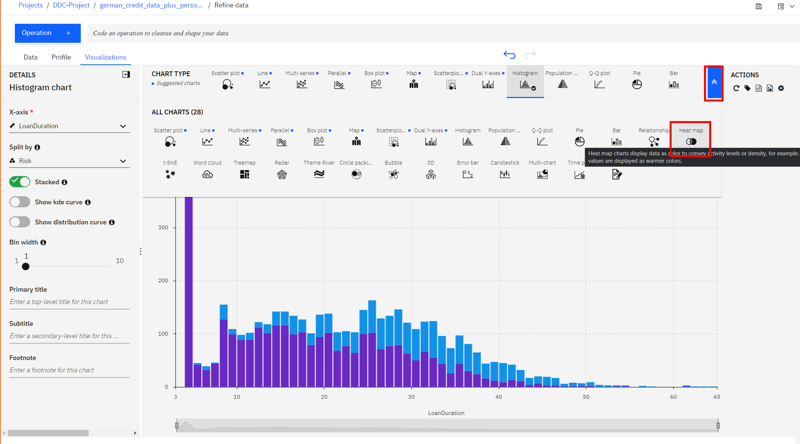](../images/dr/dr-vis-select-heatmap.png)

* Next, select `Risk` in the column section and `LoanPurpose` for the Row section. Additionally, to see the effects of the loan duration, select `Mean` in the summary section, and select `LoanDuration` in the `Value` section.

  

* You can now see that the least risky loans are those taken out for purchasing a new car and they are on average 10 years long. To the left of that cell we see that loans taken out for the same purpose that average around 15 years for term length seem to be more risky. So one could conclude the longer the loan term is, the more likely it will be risky. In contrast, we can see that both risky and non-risky loans for the `other` category seem to have the same average term length, so one could conclude that there's little, if any, relationship between loan length and its riskiness for the loans of type `other`.

* In general, for each row, the bigger the color difference between the right and left column, the more likely that loan duration plays a role for the riskiness of the loan category.

* Now let's look into customizing our plot. Under the `Actions` panel, notice that you can perform tasks such as `Start over`, `Download chart details`, `Download chart image`, or set `Global visualization preferences` (_Note: Hover over the icons to see the names_).

* Click on the `gear` icon in the `Actions` panel. We see that we can do things in the `Global visualization preferences` for `Titles`, `Tools`, `Theme`, and `Notifications`. Click on the `Theme` tab and update the color scheme to `Dark`. Then click the `Apply` button, now the colors for all of our charts will reflect this. Play around with various Themes and find one that you like.

  [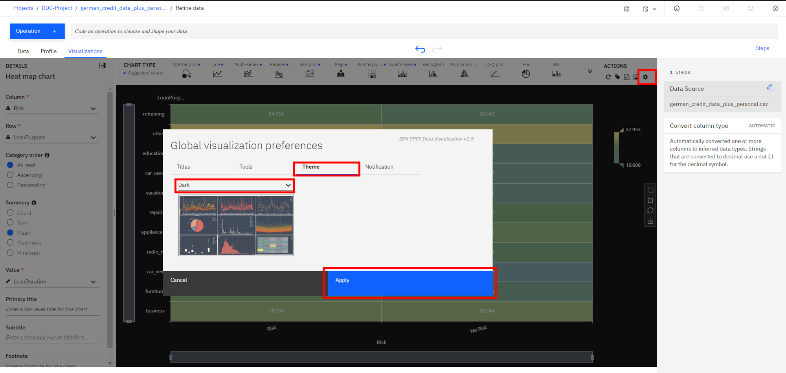](../images/dr/dr-vis-choose-theme.png)

* Finally, to save our plot as an image, click on the image icon on the top right, highlighted below, and then save the image.
  
  [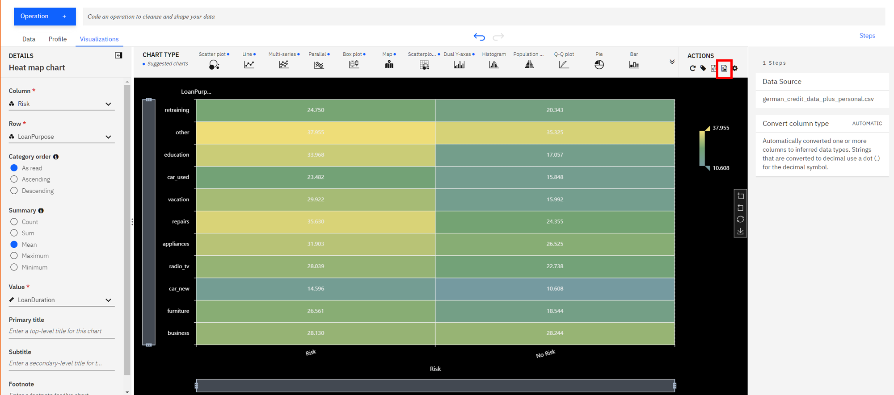](../images/dr/dr-vis-save.png)

### Conclusion

We've seen a some of the capabilities of the Data Refinery. We saw how we can transform data using R code, as well as using various operations on the columns such as changing the data type, removing empty rows, or deleting the column altogether. We next saw that all the steps in our Data Flow are recorded, so we can remove steps, repeat them, or edit an individual step. We were able to quickly profile the data, to see histograms and statistics for each column. And finally we created more in-depth Visualizations, creating a scatter plot, histogram, and heatmap to explore the relationship between the riskiness of a loan and its duration, and purpose.
