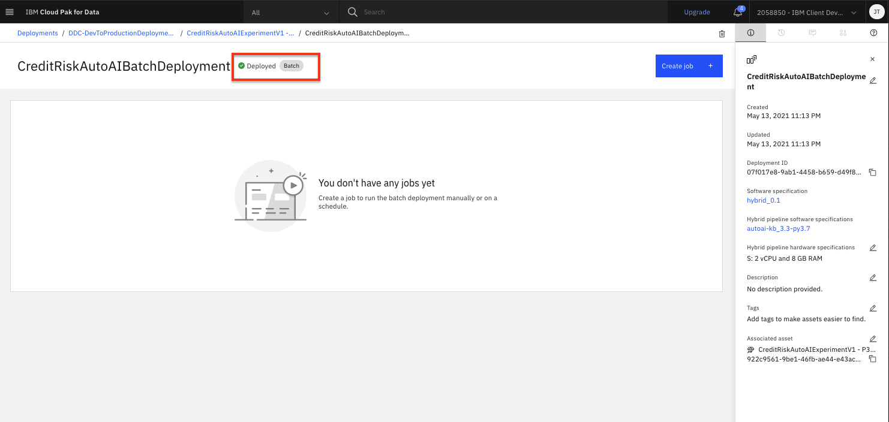
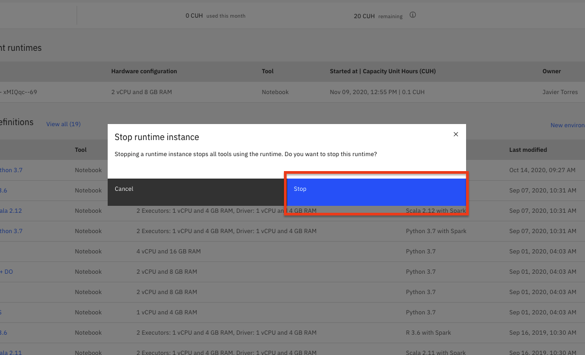

# Machine Learning Model Batch Deployment and Scoring

In this module, we will learn how to deploy our Machine Learning models. By doing so, we make them available for use in production such that applications and business processes can derive insights from them. There are several types of deployments available ([depending on the model framework used](https://www.ibm.com/support/producthub/icpdata/docs/content/SSQNUZ_current/wsj/analyze-data/pm_service_supported_frameworks.html)). In this lab, we will explore:

* Batch Deployments - Allows you to run the model against data as a batch process.

This lab will build a batch deployment and test the model endpoint by submitting a job to score a batch set of inputs.

> **Note:** You can click on any image in the instructions below to zoom in and see more details. When you do that just click on your browser's back button to return to the previous page.

> **Note:** The lab instructions below assume you have completed the setup section already, if not, be sure to complete the setup first to create a project and a deployment space. If you would have any issues, check the [FAQ section](../faq/README.md)*.

## Creating Batch Model Deployment

Another approach to expose the model to be consumed by other users/applications is to create a batch deployment. This type of deployment will make an instance of the model available to make predictions against data assets or groups of records. The model prediction requests are scheduled as jobs, which are executed asynchronously. Lets start by creating the deployment:

* Navigate to the left-hand (☰) hamburger menu, expand the `Deployments` section and click on `View all spaces`.

  

* Click on the `Spaces` tab and then choose the deployment space you setup previously by clicking on the name of your space.

* From your deployment space overview, in the table, find the model name for the model you previously built and now want to create a deployment against. Use your mouse to hover over the right side of that table row and click the `Deploy` rocket icon (the icons are not visible by default until you hover over them).

  > Note: There may be more than one model listed in them 'Models' section. This can happen if you have run the Jupyter notebook more than once or if you have run through both the Jupyter notebook and AutoAI modules to create models. Although you could select any of the models you see listed in the page, the recommendation is to start with whichever model is available that is using a `spark-mllib_2.3` runtime.

  

* On the 'Create a deployment' screen: choose `Batch` for the *Deployment Type*, give the deployment a name and optional description. From the 'Hardware definition' drop down, select the smallest option (`1 standard CPU, 4GB RAM` in this case though for large or frequent batch jobs, you might choose to scale the hardware up). Click the *`Create`* button.

  

* Once the status shows as *Deployed* you will be able to start submitting jobs to the deployment.

  

## Create and Schedule a Job

Next we can schedule a job to run against our batch deployment. We could create a job, with specific input data (or data asset) and schedule, either programmatically or through the UI. For this lab, we are going to do this programmatically using the Python client SDK. For this part of the exercise we're going to use a Jupyter notebook to create and submit a batch job to our model deployment.

>*Note: The batch job input is impacted by the machine learning framework used to build the model. Currently, SparkML based model batch jobs require inline payload to be used. For other frameworks, we can use data assets (i.e CSV files) as the input payload.*

### Run the Batch Notebook

The Jupyter notebook is already included as an asset in the project you imported earlier.

* Go the (☰) navigation menu and click on the `Projects` link and then click on your analytics project.

  

* From the project overview page, click on the `Assets` tab to open the assets page where your project assets are stored and organized.

* Scroll down to the `Notebooks` section of the page and click on the pencil icon at the right of the `machinelearning-creditrisk-batchscoring` notebook.

  

* When the Jupyter notebook is loaded and the kernel is ready, we will be ready to start executing it in the next section.

#### Notebook sections

With the notebook open, spend a minute looking through the sections of the notebook to get an overview. A notebook is composed of text (markdown or heading) cells and code cells. The markdown cells provide comments on what the code is designed to do. You will run cells individually by highlighting each cell, then either click the `Run` button at the top of the notebook or hitting the keyboard short cut to run the cell (Shift + Enter but can vary based on platform). While the cell is running, an asterisk (`[*]`) will show up to the left of the cell. When that cell has finished executing a sequential number will show up (i.e. `[17]`).

> **Note:** Please note that some of the comments in the notebook are directions for you to modify specific sections of the code. These are written in **red**. Perform any changes necessary, as indicated in the cells, before executing them.

### Stop the Environment

In order to conserve resources, make sure that you stop the environment used by your notebook(s) when you are done.

* Navigate back to your project information page by clicking on your project name from the navigation drill down on the top left of the page.

  

* Click on the 'Environments' tab near the top of the page. Then in the 'Active environment runtimes' section, you will see the environment used by your notebook (i.e the `Tool` value is `Notebook`). Click on the three vertical dots at the right of that row and select the `Stop` option from the menu.

  

* Click the `Stop` button on the subsequent pop up window.

  

* ***Important: If you have completed this section and do not plan on completing the other optional deployment approaches, please go ahead and cleanup your deployment. Follow the [Cleanup Deployment instructions.](README.md#cleanup-deployments)***

## Conclusion

Congratulations. You've completed this lab and seen how to create and test batch deployments for your machine learning models.
