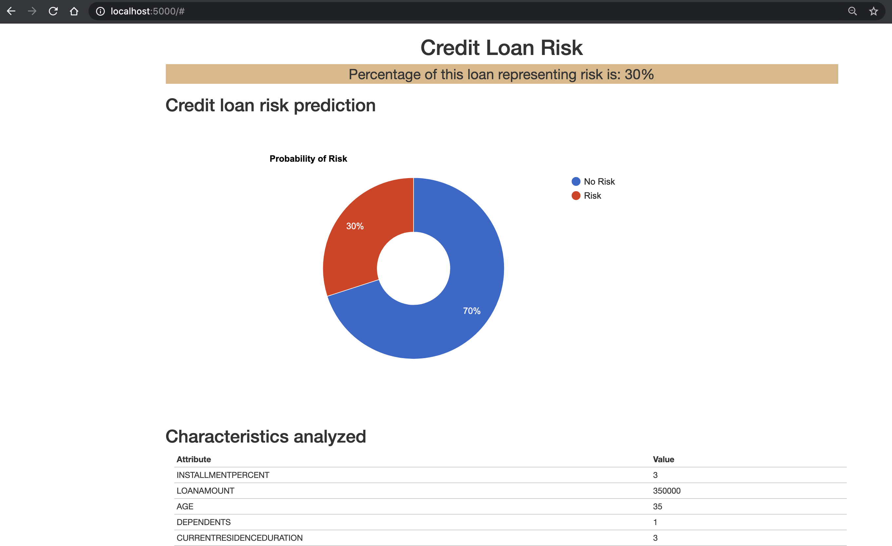

# Machine Learning Model Deployment Integration to Sample Applciation

In this module, we will access an online model deployment through a REST API. This allows you to use your model for inference in any of your apps. For this workshop we'll be using a Python Flask application to collect information, score it against the model, and show the results.

> **Note:** You can click on any image in the instructions below to zoom in and see more details. When you do that just click on your browser's back button to return to the previous page.

> **Note:** The lab instructions below assume you have completed the setup section already, if not, be sure to complete the setup first to create a project and a deployment space. It's also assumed you have created an online deployment, if not, be sure to complete the [online deployment](README.md). If you would have any issues, check the [FAQ section](../faq/README.md)*.

## Running the Python Flask Application

There are many ways of running python applications. We will cover two of them, first running as a python application on your machine, and next as a deployed application on IBM Cloud.

### Common Steps

Regardless of which option we choose for deployment, we need to configure our Python application so it knows how to connect to our specific model. To do that follow these steps.

1. Unzip the python app zip file that you downloaded in the setup section. Depending on your operation system the command to do this will differ, so an online search might be in order if you don't know how already!

2. It's best practice to store secrets and configurations as environment variables, instead of hard-coding them in the code. Following this convention, we will store our API Key and model URL in a `.env` file. The key-value pairs in this files are treated as environment variables when the code runs. To create your environment file:

   * Copy the `env.sample` file to `.env`.

     ```bash
     cp env.sample .env
     ```

   * Edit `.env` to and fill in the `MODEL_URL` and `API_TOKEN` variables.

      * `API_TOKEN` is your API Token that we created during the setup module. .
      * `MODEL_URL` is your online deployment's endpoint. If you need to get the endpoint again:

        * Go to the (☰) hamburger menu > `Deployments` > `View all spaces`.
        * Select your Deployment Space name from the [pre-work](https://ibm-developer.gitbook.io/cloudpakfordata-credit-risk-workshop/v/workshop-DDC/getting-started/pre-work) section
        * Select your model from the ML with [Jupyter Notebook](https://ibm-developer.gitbook.io/cloudpakfordata-credit-risk-workshop/v/workshop-DDC/credit-risk-workshop/machine-learning-in-jupyter-notebook) section.
        * In the `Online` tab, select your deployment's name.
        * Finally, you can find the Endpoint in the API reference section.

   * Here is an **example** of a completed lines of the .env file. Your `API_TOKEN` and `MODEL_URL` will defer.

     ```bash
     # Copy this file to .env.
     # Edit the .env file with the required settings before starting the app.

     # 1. Required: Provide your web service URL for scoring.
     # E.g., MODEL_URL=https://<cluster_url>/v4/deployments/<deployment_space_guid>/predictions
     MODEL_URL=https://us-south.ml.cloud.ibm.com/ml/v4/deployments/012f3ebd-9885-4d1f-a720-9d2f2008ff2a/predictions?version=2020-10-31
     
     # 2. Required: fill in EITHER section A OR B below:

     # ### A: Authentication using API_TOKEN
     #   Fill in your API Token. You don't need to update the TOKEN_REQUEST_URL
     #   Example:
     #     TOKEN_REQUEST_URL=https://iam.ng.bluemix.net/identity/token
     #     API_TOKEN=<Your API Key>
     TOKEN_REQUEST_URL=https://iam.ng.bluemix.net/identity/token
     API_TOKEN=0evvIIfebBQZc2AIxWE2rYkYc2KGAoiHpMiphntzhxqO
     ```

3. And we're done! Now you can proceed to your favorite option below.

### Option 1: Running locally on your machine

Choose this option if you want to run the Python Flask application locally on our machines. Note that this application will still access your deployed model in Cloud Pak for Data as a Service over the internet.

> **Important pre-requisite:** You need to have a working installation of Python 3.6 or above.

#### Installing the dependencies

You could run this Python application in your default python environment; however, the general recommendation for Python development is to use a virtual environments (see [`venv`](https://docs.python.org/3/tutorial/venv.html)). To install and initialize a virtual environment, use the `venv` module on Python 3:

* Initialize a virtual environment with [`venv`](https://docs.python.org/3/tutorial/venv.html). Run the following commands in a terminal (or command prompt):

  ```bash
  # Create the virtual environment using Python.
  # Note, it may be named python3 on your system.
  python -m venv venv       # Python 3.X

  # Source the virtual environment. Use one of the two commands depending on your OS.
  source venv/bin/activate  # Mac or Linux
  ./venv/Scripts/activate   # Windows PowerShell
  ```

  > **TIP** To terminate the virtual environment use the `deactivate` command.

* Next, to install the Python requirements, from a terminal (or command prompt) navigate to where you downloaded the python app zip file during the setup section. Unzip the downloaded python application and run the following commands:

  ```bash
  cd flaskapp
  pip install -r requirements.txt
  ```

#### Start and Test the Application

Now we are ready to start our python application.

* From a terminal (or command prompt), run the following commands (inside the python application directory):

  ```bash
  # You might need to use python3 instead of python
  python creditriskapp.py
  ```

* Finally, use your web browser to go to [http://localhost:5000](http://localhost:5000) and try it out.

* Either use the default values pre-filled in the input form, or modify the value and then click the `Submit` button. The python application will invoke the predictive model and a risk prediction & probability is returned:

  [](../images/deployment/flaskapp-output.png)

* Feel free to test other input values, from your terminal enter `ctrl`+`c` to stop the Flask server when you are done.

* ***Important: Please go ahead and cleanup your deployments. Follow the [Cleanup Deployment instructions below.](README.md#cleanup-deployment)***

### Option 2: Running on IBM Cloud

As an alternative, you can deploy this application in the your IBM Cloud account as a Cloud Foundry application.

> **Important pre-requisite:** You will need a working installation of IBM Cloud CLI. ([See how to get started](https://cloud.ibm.com/docs/cli?topic=cli-getting-started))

* Configuring our application:
  * [Optional]: You can inspect or change the deployment definitions for this application in the file named `manifest.yml`. As defined, your application will have a random URL. You can could change that by setting `random-route: false` and picking a unique name in the `name` section.

* Authenticating with the IBM Cloud:
  * Make sure you have the IBM Cloud CLI installed
  * In a terminal, enter the command `ibmcloud login` to login and authenticate. (You can also use `ibmcloud login --sso` if your organization uses single-sign-on)
  * Target the desired cloud foundry endpoint by using the following `ibmcloud target --cf`

* Publishing our Application
  * We are now ready to publish our application. In the terminal, enter the command `ibmcloud cf push` to push your application to the cloud. Once it is complete you will see the URL for your application on the IBM Cloud.

* Testing our application
  * For the final step, navigate to the URL that you got after publishing your application
  * You can then change the fields and click `Submit`. The application makes a call to your deployed model on the backend and visualize the predictions for you. All on the Cloud!
  
* And we are all done. We configured our application, logged in using the IBM Cloud cli, and published our application to the cloud.

* ***Important: Please go ahead and cleanup your deployments. Follow the [Cleanup Deployment instructions below.](README.md#cleanup-deployment)***

## Conclusion

Congratulations. You've completed this lab and seen how to integrate an online model deployment to a sample applications.
