# Automate model building with AutoAI

In this module,, we'll learn how to use [AutoAI](https://dataplatform.cloud.ibm.com/docs/content/wsj/analyze-data/autoai-overview.html?audience=wdp). The AutoAI tool is a capability that automates various tasks to ease the workflow for data scientists that are creating machine learning models. AutoAI automatically analyzes your data and generates candidate model pipelines customized for your predictive modeling problem.  These model pipelines are created iteratively as AutoAI analyzes your dataset and discovers data transformations, algorithms, and parameter settings that work best for your problem setting.

This section is broken up into the following steps:

1. [Run AutoAI Experiment](#create-an-autoai-experiment)
1. [Save and Promote AutoAI Model](#save-and-promote-autoai-model)
1. [Save AutoAI Notebooks](#save-autoai-notebooks)
1. [Conclusion](#conclusion)

> **Note:** You can click on any image in the instructions below to zoom in and see more details. When you do that just click on your browser's back button to return to the previous page.

> **Note:** The lab instructions below assume you have completed the setup section already, if not, be sure to complete the setup first to create a project and a deployment space.

## Create an AutoAI Experiment

* Go the (☰) navigation menu, expand `Projects` and click on the project you created during the setup section.

    [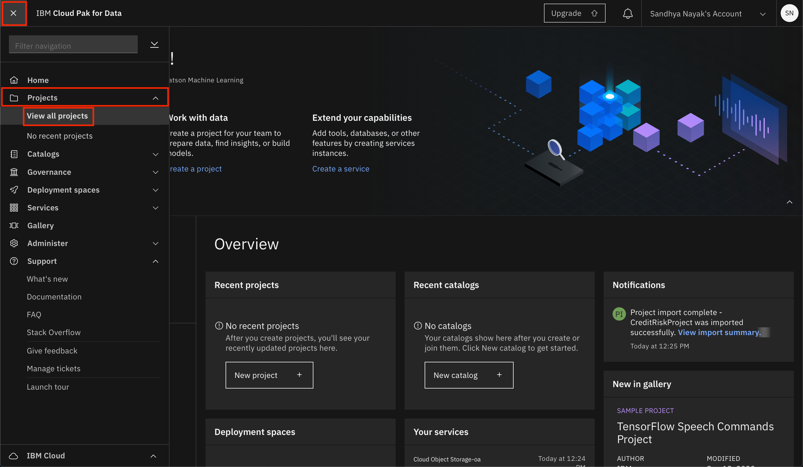](../images/navigation/menu-projects.png)

* To start the AutoAI experiment, click the `Add to project +` button from the top of the page and select the `AutoAI experiment` option.

    [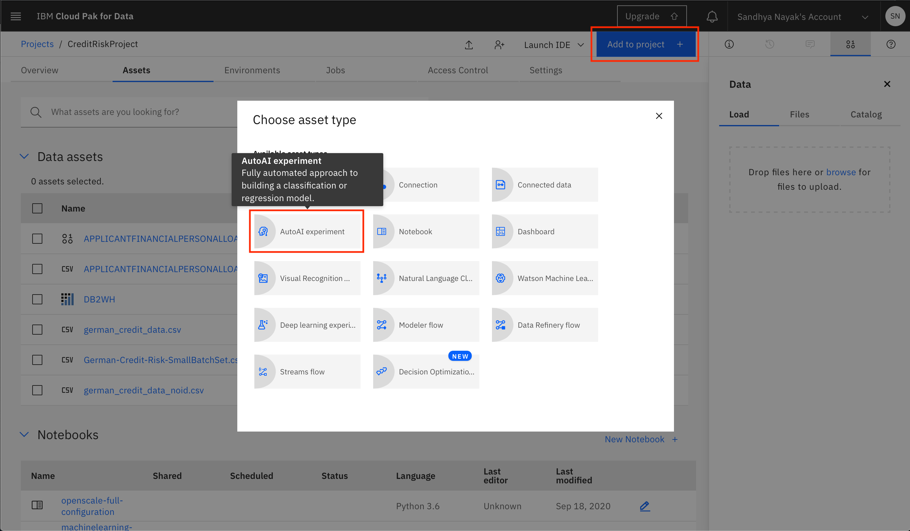](../images/autoai/autoai-add-project.png)

* Give the AutoAI experiment any name you like. The associated Watson Machine Learning Service Instance should already be populated for you. If not, please select the one that you created in the setup section from the drop down. Then click the `Create` button.

    [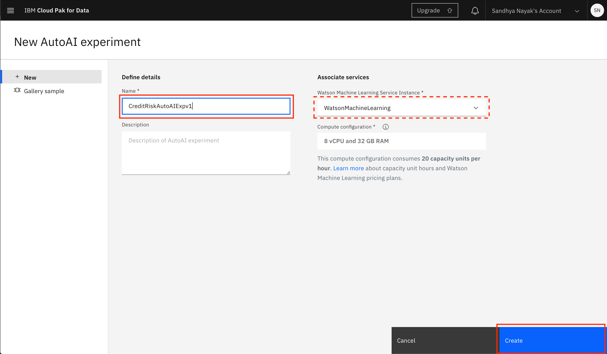](../images/autoai/autoai-name-experiment.png)

* To configure the experiment, we must first give it the dataset that will be used to train the machine learning model. Click on the `Select from project` button to point to a dataset in your project.

* Now we can select the training CSV file. If you completed the previous ***Data Processing with Data Refinery*** lab module where you generated a single shaped CSV file from a refinery job, select that CSV file (the name will be whatever you selected in that module, for example: `credit_risk_shaped`). If you did not complete that module, go ahead and select the `german_credit_data_noid.csv` file that was preloaded in the project. Then click the `Select asset` button.

    [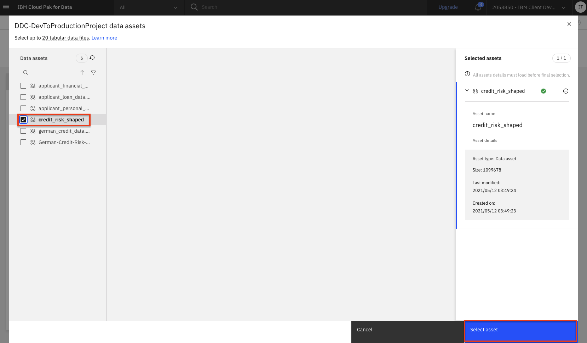](../images/autoai/autoai-select-dataset.png)

* If you are presented with a prompt to create a time series forecast, click the `No` button.

    [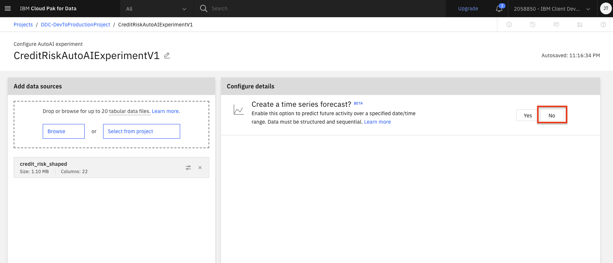](../images/autoai/autoai-no-forecast.png)

* Now, we will need to indicate what we want the model to predict. Under `What do you want to predict?` panel, select the `Prediction column` as `Risk`.

* AutoAI will set up defaults values for the experiment based on the dataset and the column selected for the prediction. This includes the type of model to build, the metrics to optimize against, the test/train split, etc. To view/change these values, click the *`Experiment settings`* button.

    [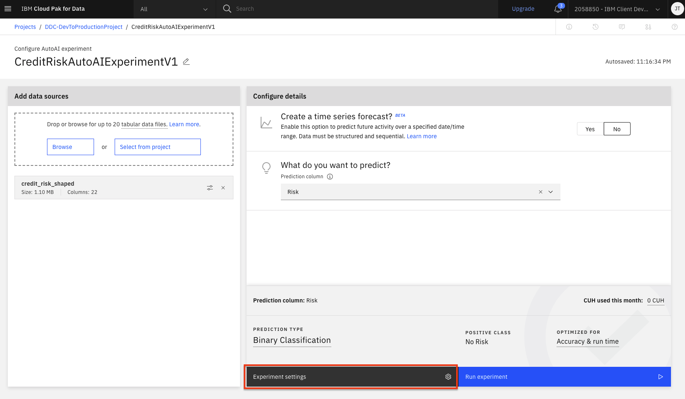](../images/autoai/autoai-choose-prediction-and-configure.png)

* Click on the `Data source` tab and scroll down to the `Select features to include` section. Deselect the checkbox for the `CustomerID` column name. This will remove the customer ID column from being used as a feature for the model. Although we could change other aspects of the experiment, we will accept the remaining default values and click the `Save settings` button. (*Feel free to explore the other possible settings before clicking the save button*).

    [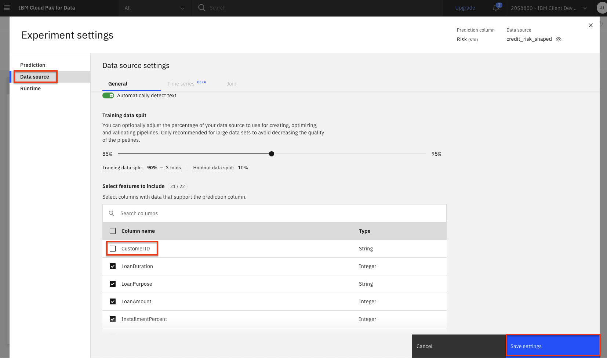](../images/autoai/autoai-exp-settings-columns.png)

* To start the experiment, click on the `Run experiment` button.

    [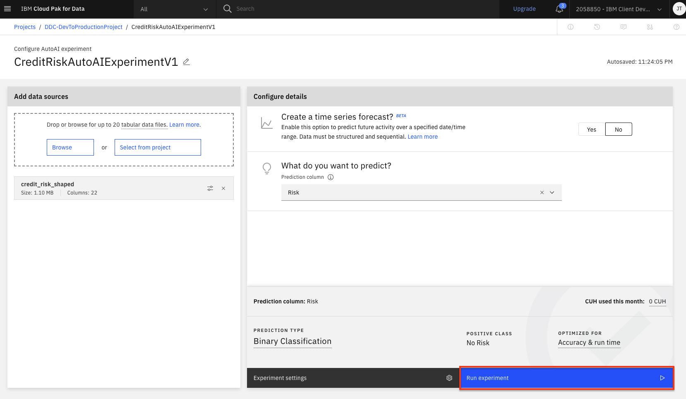](../images/autoai/autoai-exp-run.png)

* The AutoAI experiment will now run. AutoAI will run through steps to prepare the dataset, split the dataset into training / evaluation groups and then find the best performing algorithms / estimators for the type of model. It will then build the following series of candidate pipelines for each of the top N performing algorithms (where N is a number chosen in the configuration which defaults to 2):

    * Baseline model (Pipeline 1)
    * Hyperparameter optimization (Pipeline 2)
    * Automated feature engineering (Pipeline 3)
    * Hyperparameter optimization on top of engineered features (Pipeline 4)

* The UI will show progress as different algorithms/evaluators are selected and as different pipelines are created and evaluated. You can view the performance of the pipelines that have completed by expanding each pipeline section in the leaderboard.

    [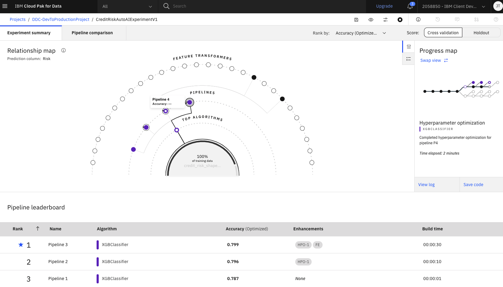](../images/autoai/autoai-pipeline-progress.png)

* The experiment can take several minutes to complete. Upon completion you will see a message that the pipelines have been created. Do not proceed to the next section until the experiment completes.

## Save and Promote AutoAI Model

* Once the experiment completes, you can explore the various pipelines and options in the UI. Some of the options available are to see a comparison of the pipelines, to change the ranking based on a different performance metric, to see a log of the experiment, or to see the ranked listing of the pipelines (ranking based on the optimization metric in your experiment, in this case, accuracy).

    [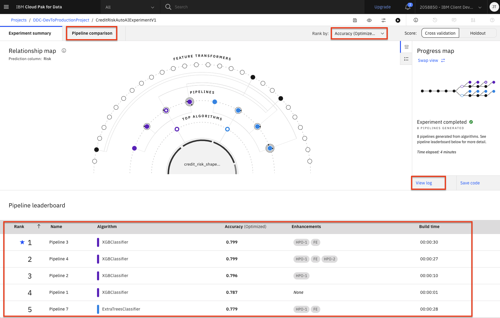](../images/autoai/autoai-pipelines-complete.png)

* Scroll down to see the `Pipeline leaderboard`. The top performing pipeline is in the first rank.

* The next step is to select the model that gives the best result and view its performance. In this case, Pipeline 3 gave the best result for our experiment. You can view the detailed results by clicking the corresponding pipeline name from the leaderboard:

    [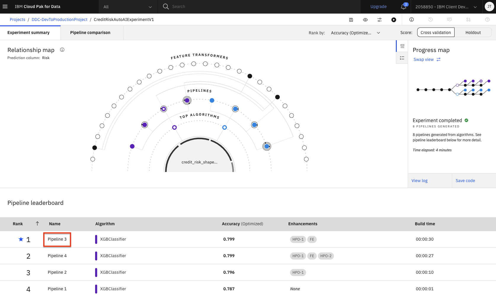](../images/autoai/autoai-pipeline-leaderboard-topranked.png)

* The model evaluation page will show metrics for the experiment, confusion matrix, feature transformations that were performed (if any), which features contribute to the model, and more details of the pipeline. Optionally, feel free to click through these views of the pipeline details.

    [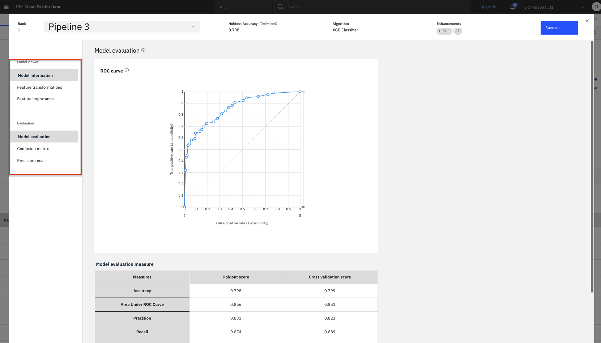](../images/autoai/autoai-toppipeline-details.png)

* In order to deploy this model, click on the *`Save as`* button. On the next scren, select the `Model` option. Keep the default name, add an optional description and tags, and click the `Create` button to save the model.

    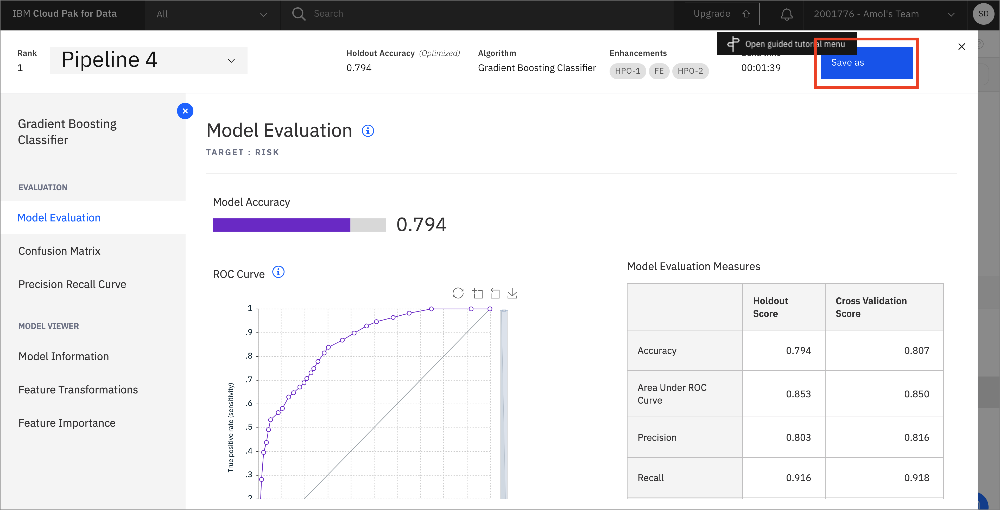

* You will see a notification to indicate that your model is saved to your project. Click the `View in project` link in the notification to go to the saved model. (*Alternatively, if you navigate back to your project assets tab by closing the pipeline and AutoAI experiment, you will see the saved model in the `Models` section, which you can click on to explore*).

    

* To make the model available to be deployed, we need to make it available in the deployment space you created during the setup module. Click on the `Promote to deployment space`:

    [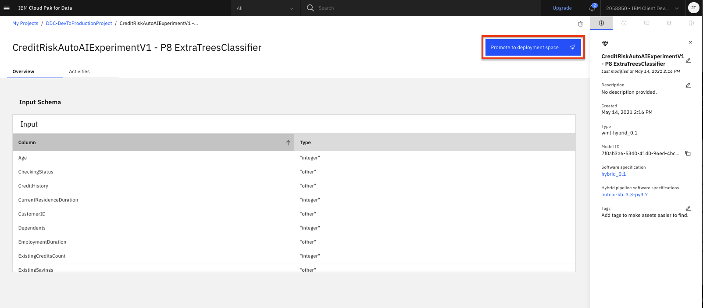](../images/autoai/autoai-promote-to-space.png)

* Select the deployment space that was created as part of the setup module as the `Target space` and click `Promote`.

    [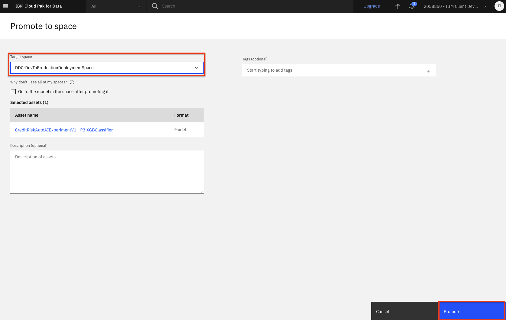](../images/autoai/autoai-promote-to-space-confirm.png)

* You will be brought back to your project assets page and see a notification that the model was promoted to the deployment space succesfully. Feel free to close that notification.

## Save AutoAI notebooks

In addition to saving models, we now have the ability to save a Jupyter notebook with working code. This can be the code representation of the AutoAI experiment (with access to all of the generated pipelines), or it can be the implementation of a specific pipeline. Let's explore how we can save both the experiment and a pipeline as a notebook.

* To save the AutoAI experiment as a notebook, navigate back to the AutoAI experiment overview page by clicking on the AutoAI experiment name in your project assets page (under the `AutoAI experiments` section).

* Click on the `Save code` link in the 'Progress map' section of the UI.

    [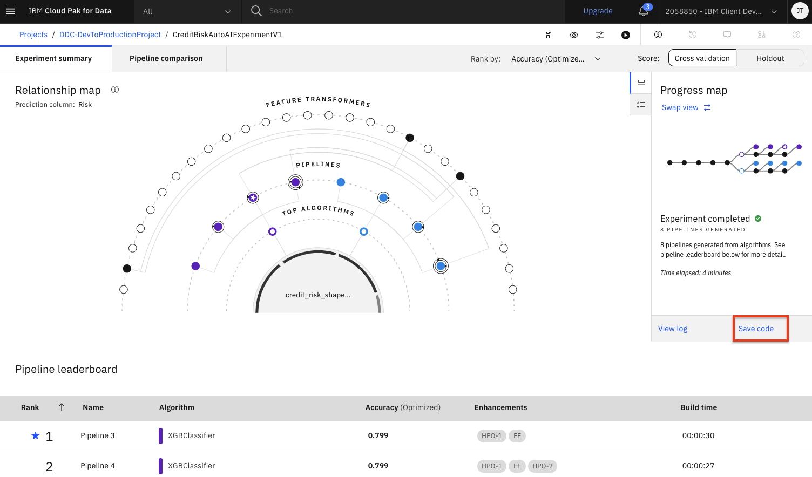](../images/autoai/autoai-experiment-save-code.png)

* Leave the default name and click the `Create` button to save the experiment as a notebook.

    [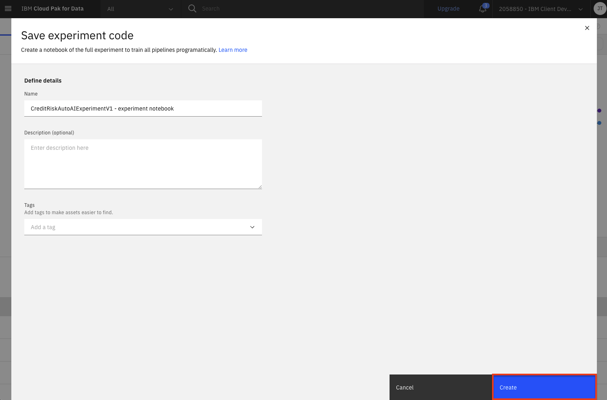](../images/autoai/autoai-experiment-save-code-create.png)

* To save the AutoAI pipeline as a notebook, from the experiment overview page, scroll down to the pipeline leader board section. Then hover over the right side of one of the other pipelines and click the resulting `Save as` button. For sake of demonstration, we are going to save a pipeline for an algorithm that is different from the model we saved in the previous section (i.e in this case Pipeline 7).

    [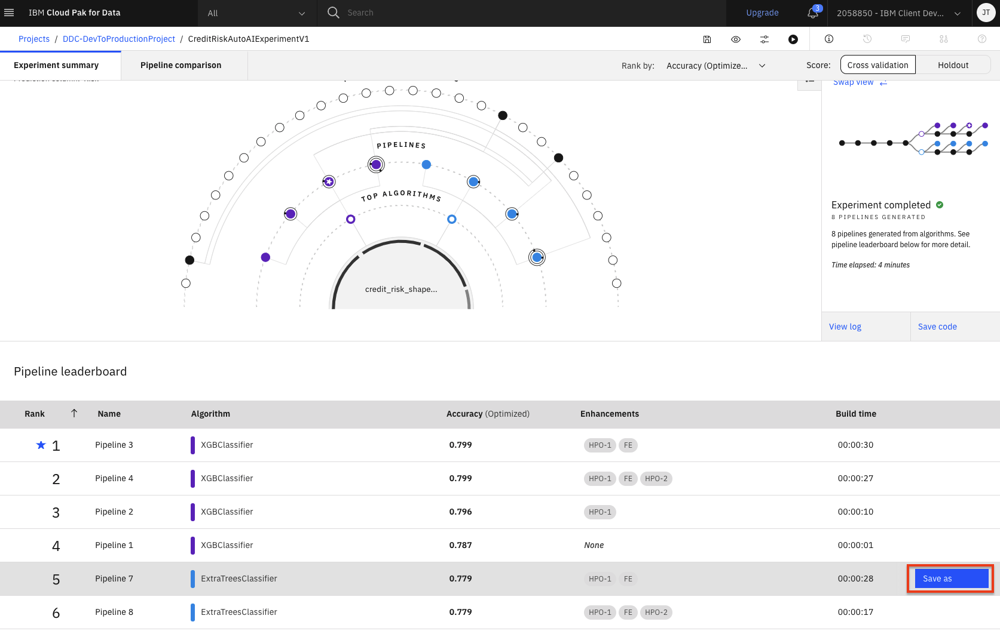](../images/autoai/autoai-pipeline-for-notebook.png)

* Choose the `Notebook` tile, accept the default name, add an optional description, and click the `Create` button.

    [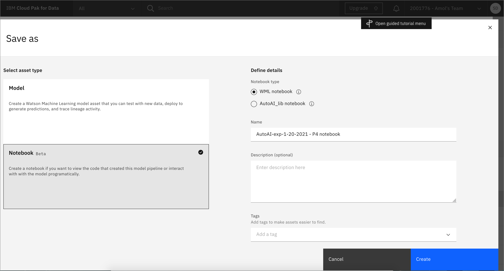](../images/autoai/autoai-save-as-notebook.png)

* You will receive a notification to indicate that your notebook is saved to your project. Close the notification and then click on your project name in the project path at the top of the screen.

    [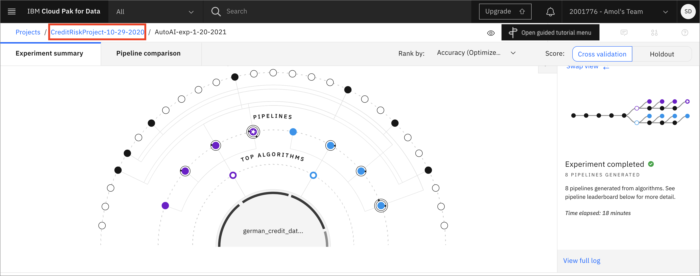](../images/autoai/autoai-navigate-to-project.png)

* The notebook will be saved to your project, and can be examined in detail, changed and modified, and used to create a new model. See the instructions in the [Modifying and running an AutoAI generated notebook](./running-autoai-notebook.md) lab for details.

## Conclusion

Congratulation. We have now successfully created a highly optimized machine learning model using AutoAI and prepared it for deployment.

In this section we covered one approach to building machine learning models on Cloud Pak for Data as a Service. We have seen how AutoAI helps to find an optimal model by automating tasks such as:

* Data Wrangling
* Algorithm Evaluation & Selection
* Feature Engineering
* Hyperparameter Optimization
