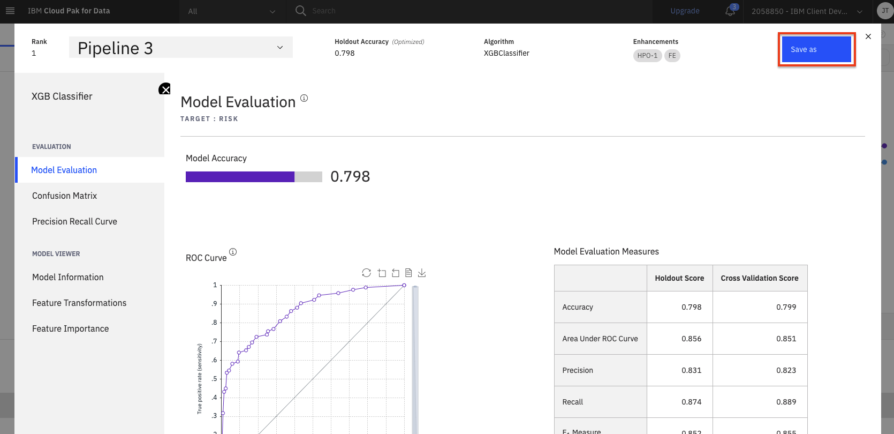
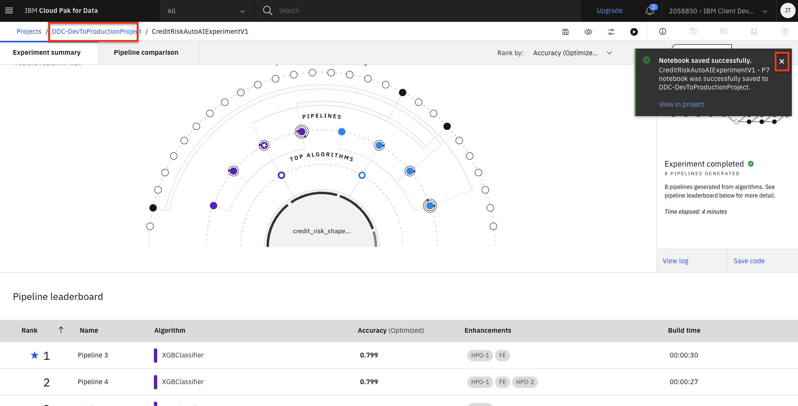
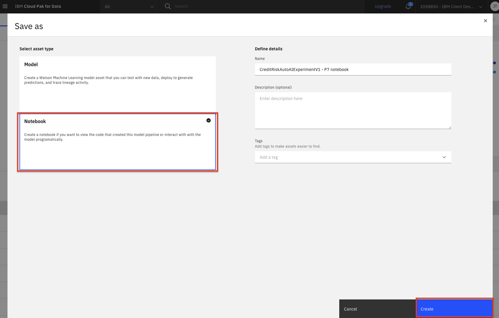

# Automate model building with AutoAI

For this part of the workshop, we'll learn how to use [AutoAI](https://dataplatform.cloud.ibm.com/docs/content/wsj/analyze-data/autoai-overview.html?audience=wdp). The AutoAI tool is a capability that automates various tasks to ease the workflow for data scientists that are creating machine learning models. AutoAI automatically analyzes your data and generates candidate model pipelines customized for your predictive modeling problem.  These model pipelines are created iteratively as AutoAI analyzes your dataset and discovers data transformations, algorithms, and parameter settings that work best for your problem setting.

This section is broken up into the following steps:

1. [Run AutoAI Experiment](#create-an-autoai-experiment)
1. [Save AutoAI Model](#save-autoai-model)
1. [Save AutoAI Notebook](#save-autoai-notebook)
1. [Promote a Model](#promote-the-model)
1. [Conclusion](#conclusion)

> **Note:** You can click on any image in the instructions below to zoom in and see more details. When you do that just click on your browser's back button to return to the previous page.

> **Note:** The lab instructions below assume you have completed the setup section already, if not, be sure to complete the setup first to create a project and a deployment space.

## Create an AutoAI Experiment

* Go the (☰) navigation menu, expand `Projects` and click on the project you created during the setup section.

  

* To start the AutoAI experiment, click the `Add to project +` button from the top of the page and select the `AutoAI experiment` option.

  

* Name your AutoAI experiment asset. The Associated Watson Machine Learning Service Instance should already be populated for you. If not, please select the one that you created in pre-work section from the drop down. Then click the `Create` button.

  

* To configure the experiment, we must first give it the dataset that will be used to train the machine learning model. We will be using the CSV file that we have preloaded into the project. Click on the `Select from project` option.

  

* In the dialog, select the `german_credit_data_noid.csv` file and click the `Select asset` button.

  

* Once the dataset is loaded, we will need to indicate what we want the model to predict. Under `What do you want to predict?` panel, select the `Prediction column` as `Risk`.

* AutoAI will set up default values for the experiment based on the dataset and the column selected for the prediction. This includes the type of model to build, the metrics to optimize against, the test/train split, etc. You could view and change these values under `Experiment settings`, however, for now we will accept the defaults and click the `Run experiment` button.

  

* The AutoAI experiment will now run. AutoAI will run through steps to prepare the dataset, split the dataset into training / evaluation groups and then find the best performing algorithms / estimators for the type of model. It will then build the following series of candidate pipelines for each of the top N performing algorithms (where N is a number chosen in the configuration which defaults to 2):

  * Baseline model (Pipeline 1)
  * Hyperparameter optimization (Pipeline 2)
  * Automated feature engineering (Pipeline 3)
  * Hyperparameter optimization on top of engineered features (Pipeline 4)

* The UI will show progress as different algorithms/evaluators are selected and as different pipelines are created and evaluated. You can view the performance of the pipelines that have completed by expanding each pipeline section in the leaderboard.

  

* The experiment can take several minutes to complete. Upon completion you will see a message that the pipelines have been created. Do not proceed to the next section until the experiment completes.

## Save AutoAI Model

* Once the experiment completes, you can explore the various pipelines and options in the UI. Some of the options available are to see a comparison of the pipelines, to change the ranking based on a different performance metric, to see a log of the experiment, or to see the ranked listing of the pipelines (ranking based on the optimization metric in your experiment, in this case, accuracy).

  

* Scroll down to see the `Pipeline leaderboard`. The top performing pipeline is in the first rank.

* The next step is to select the model that gives the best result and view its performance. In this case, Pipeline 4 gave the best result for our experiment. You can view the detailed results by clicking the corresponding pipeline name from the leaderboard:

  

* The model evaluation page will show metrics for the experiment, confusion matrix, feature transformations that were performed (if any), which features contribute to the model, and more details of the pipeline. Optionally, feel free to click through these views of the pipeline details.

  

* In order to deploy this model, click on the `Save as` button.

  

* Choose the `Model` tile, accept the default name or change it if you like. Add optional description or tags, and click `Create`.

  

* You will receive a notification to indicate that your model is saved to your project. Go back to your project main page by clicking on the `View in project` link.

  

* Alternately, closing the window will expose the path back to the project at the top of the screen.

  

* You will see the new model under `Models` section of the `Assets` page.

## Save AutoAI notebook

* To save the AutoAI experiment as a notebook, go back to the window for the pipeline you have chosen, and click `Save as`.

  

* Choose the `Notebook` tile, accept the default name or change it if you like. Add optional description or tags, and click `Create`.

  

* You will receive a notification to indicate that your notebook is saved to your project. Go back to your project main page by clicking on the `View in project` link.

  

* Alternately, closing the window will expose the path back to the project at the top of the screen.

  

* The notebook will be saved to your project, and can be examined in detail, changed and modified, and used to create a new model. See the documentations for [Modifying and running an AutoAI generated notebook](./running-autoai-notebook.md) for details.

## Promote the model

* Now that we have saved our model, we can promote it to our deployment space for deployment. Under the `Models` section of the `Assets` page, click the name of your saved model:

  

* Next, click on the `Promote to deployment space`:

  

* Select the deployment space that was created as part of the pre-work as the `Target space` and click `Promote`.

> ***Note***: This is assuming you have already created a deployment space in the `pre-work` section of the workshop.

  

* You will see a notification that the model was promoted to the deployment space succesfully.

  

## Conclusion

Congratulation. We have now successfully created a highly optimized machine learning model using AutoAI and prepared it for deployment.

In this section we covered one approach to building machine learning models on Cloud Pak for Data as a Service. We have seen how AutoAI helps to find an optimal model by automating tasks such as:

* Data Wrangling
* Algorithm Evaluation & Selection
* Feature Engineering
* Hyperparameter Optimization
