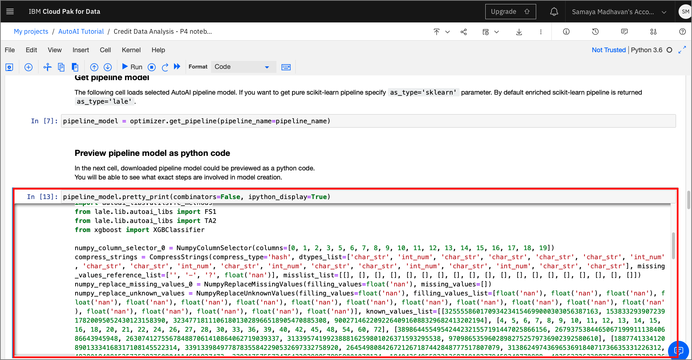
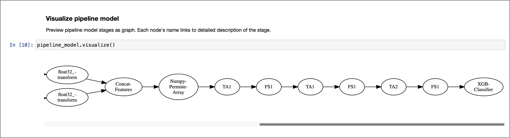
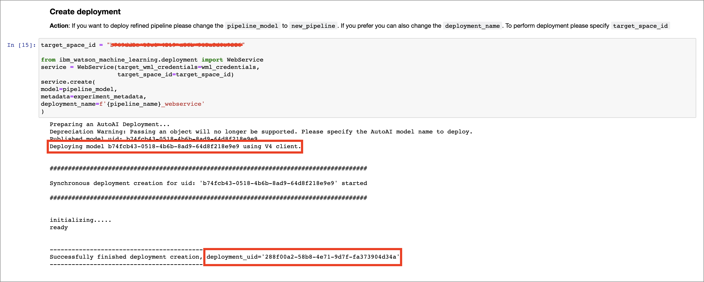
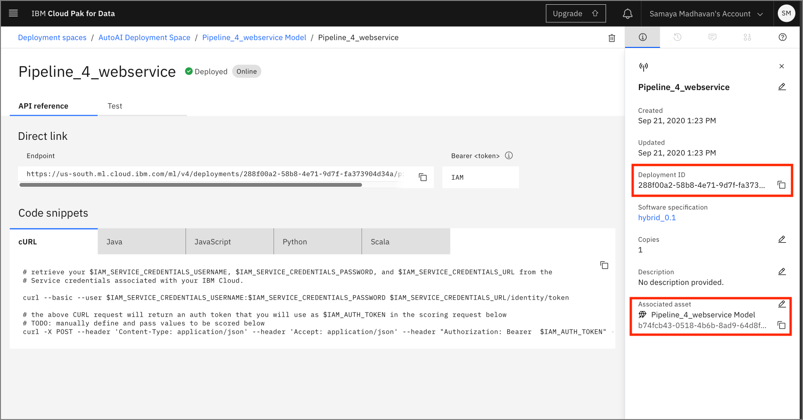
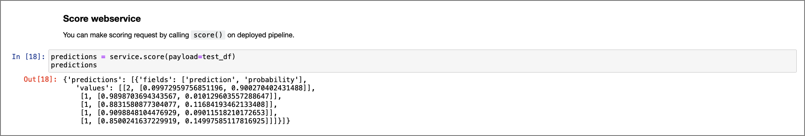

# Modifying and Running an AutoAI Generated Notebook

In this module, we'll explore how to run an AutoAI pipeline jupyter notebook. The notebook allows you to interact with the experiment or pipeline (pipeline notebooks are currently only supported for single data source, non-time series experiments) programmatically. This exploration will help you understand the transformations applied to build a model.

> **Note:** You can click on any image in the instructions below to zoom in and see more details. When you do that just click on your browser's back button to return to the previous page.

> **Note:** The lab instructions below assume you have completed the setup section already, if not, be sure to complete the setup first to create a project and a deployment space. It is also assumed you have completed the [AutoAI lab](README.md) where you completed an AutoAI experiment and saved a pipeline as a Jupyter notebook which you will be exploring in this module.

## Open Juptyer Notebook

* Go the (☰) navigation menu, expand `Projects` and click on the project you created during the setup section.

    [](../images/navigation/menu-projects.png)

* From your `Project` overview page, click on the `Assets` tab to open the assets page where your project assets are stored and organized.

* Scroll down to the `Notebooks` section of the page and click on the pencil icon at the right of the `machinelearning-creditrisk-sparkmlmodel` notebook.

    [](../images/autoai/autoai-open-jupyternotebook.png)

* When the Jupyter notebook is loaded and the kernel is ready, we will be ready to start executing it in the next section.

## Run Jupyter notebook

Spend some time looking through the sections of the notebook to get an overview. A notebook is composed of text (markdown or heading) cells and code cells. The markdown cells provide comments on what the code is designed to do.

You will run cells individually by highlighting each cell, then either click the `Run` button at the top of the notebook or hitting the keyboard short cut to run the cell (Shift + Enter but can vary based on platform). While the cell is running, an asterisk ([\*]) will show up to the left of the cell. When that cell has finished executing a sequential number will show up (i.e. [17]).

[](../images/autoai/ExecuteAutoAINotebook.gif)

The notebook generated is pre filled with Python code and is divided into the following sections:

* [1.0 Setup](#10-setup)
* [2.0 Pipeline inspection](#20-pipeline-inspection)
* [3.0 Deploy and score as web service using WML instance](#30-deploy-and-score-as-web-service-using-wml-instance)

### 1.0 Setup

This section contains credentials to *Cloud Object Storage* through which the current AutoAI pipeline is retrieved. The cell contains code prefilled to extract the training data used to create the pipeline and the pipeline results.

[]()

Also this section contains the metadata of the current pipelines that were used to run the experiment.

[]()

### 2.0 Pipeline inspection

Within this section of the notebook, there is code that extracts the current model and prints it as Python code.

[]()

This section also contains code to visualize the stages within the model as a graph using Watson Machine Learning's AutoAI APIs.

[]()

### 3.0 Deploy and score as web service using WML instance

This section of the notebook contains code that deploys the pipeline model as a web service using Watson Machine Learning. This section requires users to enter credentials to be able to identify the right WML instance and deployment space. The two credentials are `api_key` and `target_space_id`

#### api_key

To be able to access the WML instance, the user will need to generate an *api key* through the cloud account and paste it in the cell as shown in the cell below. The instructions to acquire the *cloud api key* is described in the markdown section of the screenshot shown below.

[]()

#### target_space_id

You'll need a *target_space_id* from your deployment space, either created in an earlier part of this workshop or you may create one right now, if needed.

>*Either get the target_space_id or create a deployment space now*:

[]()

>
>1. Click on the hamburger menu on the top-left corner of the Cloud Pak for Data home page.
>1. Click on `Deployment Spaces` from the list and select `View all spaces`
>1. If you haven't created a deployment space previously, click `New deployment space`, select `Create an empty space` option.
>1. For a new `Deployment Space`, provide a name, select a machine learning service that was previously created and click `Create`
>1. Either click on the existing `Deployment Space` or click `View new space` and switch to the `Settings` tab and copy the `space id`

Acquire the *target_space_id* as shown in the steps above and paste within the create deployment section. The Watson Machine Learning API uses the `wml_credentials` and the `target_space_id` to deploy the machine learning model as a web service.

[]()

Once the cells are executed, the model is promoted to the deployment space and is now available as a web service and can be verified from within the UI, or using the Python SDK as demonstrated in the notebook.

[]()

#### Score web service

For details on how to test the deployed model using the UI, see the steps in the [Machine Learning Deployment and Scoring Lab](../machine-learning-deployment-scoring/README.md#test-online-model-deployment)

For this lab, you can test this deployment using the Python SDK by running the final cell in the notebook:

```python
predictions = service.score(payload=test_df)
predictions
```

[]()

## Conclusion

In this part of the lab, we examined and ran a Jupyter notebook that was generated as the result of an AutoAI experiment. Feel free to modify and re-run the notebook, making any changes that you are comfortable with.
