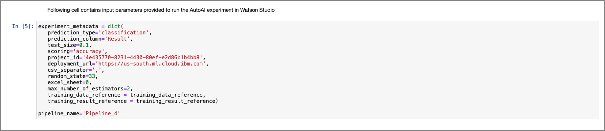
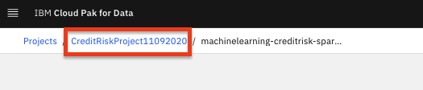

# Modifying and Running an AutoAI Generated Notebook

In this module, we'll explore how to run the AutoAI generated jupyter notebooks. The notebooks allows you to interact with the experiment or pipeline (pipeline notebooks are currently only supported for single data source, non-time series experiments) programmatically. This exploration will help you understand the transformations applied to build a model, and can serve as a starting point for further pipeline/model development.

> **Note:** You can click on any image in the instructions below to zoom in and see more details. When you do that just click on your browser's back button to return to the previous page.

> **Note:** The lab instructions below assume you have completed the setup section already, if not, be sure to complete the setup first to create a project and a deployment space. It is also assumed you have completed the [AutoAI lab](running-autoai-experiment.md) where you completed an AutoAI experiment and saved a pipeline as a Jupyter notebook which you will be exploring in this module.

## Open AutoAI Experiment Notebook

Let's start by exploring the AutoAI experiment notebook. This notebook contains all the code to view the transformations and optimizations applied to create the model pipelines. It includes generated code to access experiment details/configuration, visualize each of the pipelines, compare pipelines, and deploy individual pipelines.

* Go the (☰) navigation menu, expand `Projects` and click on the project you created during the setup section.

    [](../images/navigation/menu-projects.png)

* From your `Project` overview page, click on the `Assets` tab to open the assets page where your project assets are stored and organized.

* Scroll down to the `Notebooks` section of the page and click on the pencil icon at the right of the Auto AI experiment notebook (the exact name will be based on the name of the AutoAI experiment you ran but will end in `- experiment notebook` ).

    [](../images/autoai/autoai-open-jupyternotebook.png)

* When the Jupyter notebook is loaded and the kernel is ready, we will be ready to start executing it in the next section.

### Run Jupyter notebook

Spend some time looking through the sections of the notebook to get an overview. A notebook is composed of text (markdown or heading) cells and code cells. The markdown cells provide comments on what the code is designed to do.

You will run cells individually by highlighting each cell, then either click the `Run` button at the top of the notebook or hitting the keyboard short cut to run the cell (Shift + Enter but can vary based on platform). While the cell is running, an asterisk ([\*]) will show up to the left of the cell. When that cell has finished executing a sequential number will show up (i.e. [17]).

[](../images/autoai/ExecuteAutoAINotebook.gif)

The notebook generated is pre filled with Python code and is divided into the following sections:

* [1.0 Setup](#10-setup)
* [2.0 Experiment Configuration](#20-experiment-configuration)
* [3.0 Watson Machine Learning Connection](#30-watson-machine-learning-connection)
* [4.0 Working with Completed AutoAI Experiment](#40-working-with-completed-autoai-experiment)
* [5.0 Deploy and score](#50-deploy-and-score)

#### 1.0 Setup

* This section installs the necessary packages and libraries to run the AutoAI experiment and scikit learn pipelines. Run the cell in this section as is.

    [](../images/autoai/autoai-expnotebook-setup.png)

* After the libraries are installed, you should restart the Jupyter kernel. Click on `Kernel` menu at the top of the page and select the `Restart` option from the menu.

    > *Note: If you do not restart the kernel, as you execute furtuer cells in the notebook you may see errors indicating there are missing libraries or missing specific version of libraries.*

    [](../images/autoai/autoai-expnotebook-restartkernel.png)

#### 2.0 Experiment Configuration

* The first part of this section contains credentials to *Cloud Object Storage* through which the training data that was used to create the pipelines and the pipeline results are retrieved. Run this cell as is.

    [](../images/autoai/experiment_metadata.png)

* The next cell contains the metadata of the experiment configuration. Run the cell as is.

    [](../images/autoai/input_parameters.png)

#### 3.0 Watson Machine Learning Connection

* This section will setup the credentials to the Machine Learning instance you provisoned. In the code cell, replace the variable value `'PUT_YOUR_KEY_HERE'` with your the API key you created during the setup section. (*Note: Remember to keep the single quotes*).

* Once you've updated the api_key variable, run the two cells in this section.

    [](../images/autoai/autoai-expnotebook-wmlkey.png)

#### 4.0 Working with Completed AutoAI Experiment

* Within this section of the notebook, the first set of code cells extract the current experiment (i.e. `pipeline_optimizer`) and then gets the pipelines from the experiment to display their performance in a table. Run the cells until you see the table output from the `Pipeline Comparison` cell.

    [](../images/autoai/autoai-expnotebook-pipelinesummary.png)

* The next cell will retrieve a pipeline from the experiment. The generated code retrieves the top pipeline. Before running the cell, use a `#` to comment out the generated code: `pipeline_model = pipeline_optimizer.get_pipeline()`. Then copy the following code and paste it below the line you just commented out (*Note: your code cell should look like the code in the next screenshot*).

    ```python
    pipeline_to_explore = 'INSERT_PIPELINE_NAME_HERE'
    pipeline_model = pipeline_optimizer.get_pipeline(pipeline_name=pipeline_to_explore)
    ```

* In the code you just inserted, replace the value `INSERT_PIPELINE_NAME_HERE` with one of the pipeline names you see in the first column of the summary table (*Note: Pick a pipeline name you haven't deployed in a previous lab. In the screenshot below, we are getting the pipeline `Pipeline_7`*). Once you have updated this cell, go ahead and run it.

    [](../images/autoai/autoai-expnotebook-getpipelinename.png)

* Continue running the other cells in this section without modification, including the cell in the `Visualize pipeline model` section and the `Preview pipeline model as python code` section. The former cell output will display a graph of the pipeline. You can hover over any of the graph nodes to get information about the task being done in that step. The latter cell allows you to get the pipeline implementation as either lale wrapper code or directly sklearn pipeline representation.

    [](../images/autoai/autoai-expnotebook-visualizepipeline.png)

#### 5.0 Deploy and Score

* This section of the notebook contains code that deploys the pipeline model as a web service using Watson Machine Learning. This section requires users to enter a `target_space_id` of the deployment space where the model will be deployed.

* To get the deployment space ID for the space you created during the setup module, perform the following steps:

    * In a new browser window or tab. Navigate to the left-hand (☰) hamburger menu, expand the `Deployments` section and click on `View all spaces`.
    * Click on the `Spaces` tab and then choose the deployment space you setup previously by clicking on the name of your space.
    * Click on the `Manage` tab and then click the copy icon next to the `Space GUID`.

        [](../images/autoai/autoai-depspaceid.png)

* In the `Deployment creation` code cell, paste the space ID you just copied above as the value for the`target_space_id` variable. Also change the line: `model=best_pipeline_name,` to `model=pipeline_to_explore,#best_pipeline_name,`. This will deploy the pipeline we were exploring above to our deployment space. Go ahead and run the cell.

    [](../images/autoai/autoai-expnotebook-deploymentcreation.png)

* Once the cell is executed, the call in the SDK will both save the model to the deployment space and create an online deployment.

* Run the remaining cells in the notebook. These cells provide some samples of using the SDK to modify and run AutoAI experiments programmatically.

## (Optional) Open AutoAI Pipeline Notebook

For further exploration, you can optionally run the AutoAI pipeline notebook. This notebook contains the code to implement a specific pipeline from the experiment.

* From your `Project` overview page, click on the `Assets` tab to open the assets page where your project assets are stored and organized.

* Scroll down to the `Notebooks` section of the page and click on the pencil icon at the right of the Auto AI pipeline notebook (the exact name will be based on the name of the AutoAI experiment you ran followed by the pipeline number).

* When the Jupyter notebook is loaded and the kernel is ready, you can go ahead and run all the cells in the notebook.

* This notebook will build the pipeline and train it using the the data from the experiment.

* Note that the exact implementation will vary based on which pipeline you saved as a notebook. Some pipelines will have different features (feature engineering, HPO) and train different evaluators.

## Stop the Environment

In order to conserve resources, make sure that you stop the environment used by your notebook(s) when you are done.

* Navigate back to your project information page by clicking on your project name from the navigation drill down on the top left of the page.

    [](../images/project/navigate-to-project.png)

* Click on the 'Environments' tab near the top of the page. Then in the 'Active environment runtimes' section, you will see the environment used by your notebook (i.e the `Tool` value is `Notebook`). Click on the three vertical dots at the right of that row and select the `Stop` option from the menu.

    [](../images/project/stop-notebook-environment.png)

* Click the `Stop` button on the subsequent pop up window.

    [](../images/project/stop-notebook-environment-confirmation.png)

## Conclusion

In this part of the lab, we examined and ran a Jupyter notebook that was generated as the result of an AutoAI experiment. Feel free to modify and re-run the notebook, making any changes that you are comfortable with.
