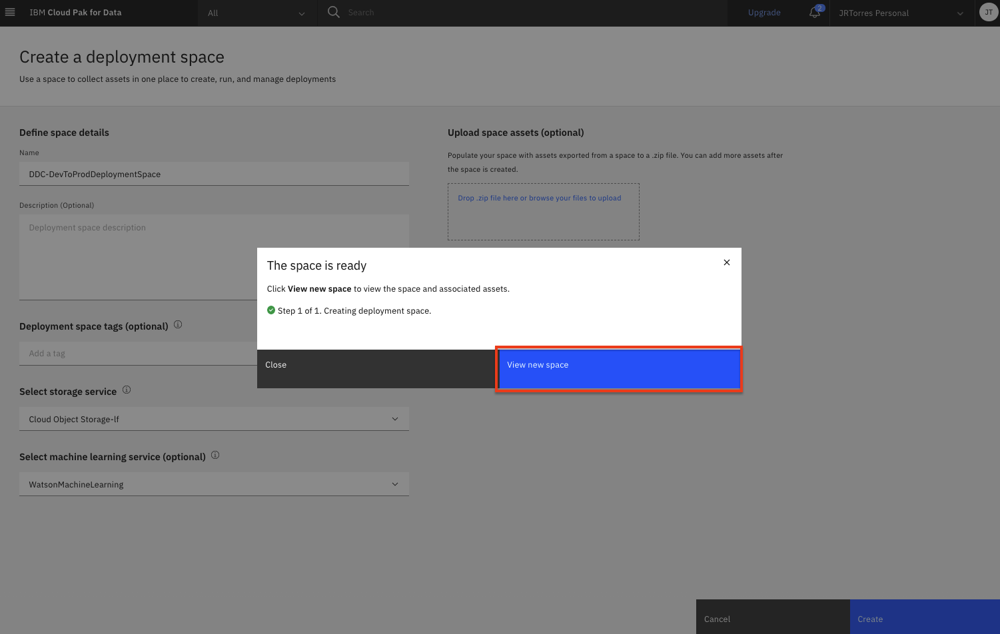

# Moving Assets Between Spaces

In this module, we will explore how we can move assets (i.e machine learning models) from one space to another space. Model operations and lifecycle management includes many different aspects that would need to be addressed, including, but not limited to: determining when a model needs to be replaced, testing models, comparing model performance, deployment testing (for example canary testing), and much more. In this lab we will focus just on the scenario of "promoting" a model asset from a deployment space that represents development to another space that could represent a staging/testing space.

> **Note:** You can click on any image in the instructions below to zoom in and see more details. When you do that just click on your browser's back button to return to the previous page.

> **Note:** The lab instructions below assume you have completed the [Model Deployment labs](../ml-model-deployment/online-model-deployment.md). You should have already created a model and promoted it to a deployment space which is what we will use in this lab. If you run into an any issues, check the [FAQ section](../faq/README.md) for common resolutions*.

## Create A New Deployment Space

Cloud Pak for Data uses the concept of `Deployment Spaces` to configure and manage the deployment of a set of related deployable assets. These assets can be data files, machine learning models, etc. We have been working with a space created during the setup module through out the previous labs.

* Go the (☰) navigation menu, expand `Deployment spaces` and then select `View all spaces`.

    

* Click on the `New deployment space` button.

    

* Give your deployment space a unique name (i.e. `TestProductionSpace` ) and optional description. In the service drop downs, select the Cloud Object Storage instance that you had created during the setup module and select the Machine Learning Service instance associated with your IBM Cloud Pak for Data as a Service instance. Then click the `Create` button.

    

* Once the deployment space is created, you can click on `View new space`.

    

* Next, we need to get the deployment space ID for this space. Click on the `Manage` tab and then click the copy icon next to the `Space GUID`. Save this ID in a notepad, we will use it later in the lab.

    

## Run the Notebook

The Jupyter notebook is already included as an asset in the project you imported during the setup module.

* Go the (☰) navigation menu and click on the `Projects` link and then click on the project you created during the setup.

    

* From the project overview page, click on the `Assets` tab to open the assets page where your project assets are stored and organized.

* Scroll down to the `Notebooks` section of the page and click on the pencil icon at the right of the `model-asset-operations` notebook.

    

* When the Jupyter notebook is loaded and the kernel is ready, we will be ready to start executing it in the next section.

### Notebook sections

With the notebook open, spend a minute looking through the sections of the notebook to get an overview. A notebook is composed of text (markdown or heading) cells and code cells. The markdown cells provide comments on what the code is designed to do. You will run cells individually by highlighting each cell, then either click the `Run` button at the top of the notebook or hitting the keyboard short cut to run the cell (Shift + Enter but can vary based on platform). While the cell is running, an asterisk (`[*]`) will show up to the left of the cell. When that cell has finished executing a sequential number will show up (i.e. `[17]`).

> **Note:** Please note that some of the comments in the notebook are directions for you to modify specific sections of the code. These are written in **red**. Perform any changes necessary, as indicated in the cells, before executing them.

* Execute the cells one at a time. Paying attention to the comments / instructions for you to update variables.

* Section `1.0 Install required packages` will install some of the libraries we are going to use in the notebook. Note that we upgrade the installed version of Watson Machine Learning Python Client. Ensure the output of the first code cell is that the python packages were successfully installed.

    

* Section `2.0 Instantiate Watson Machine Learning Client` will setup the client to the Machine Learning instance / deployment spaces where the assets are deployed.

    * In the first code cell, you will need to provide your IBM Cloud API key and Machine learning service location, which you should have from the setup module.

        

* Section `3.0 Get Assets from Development Deployment Space` will export the assets (in this case machine learning models) we want to move to a new target space. It uses the export APIs to pull specific models to a file.

    * In the second code cell of section `3.0` you will need to update the ID for your source deployment space (the space where the models are currently deployed). You could copy the ID from the output of the previous cell.

    * In the second code cell of section `3.1` you will need to provide the ID of the model we are going to export out of this space. You could copy one of the model IDs from the output of the previous cell.

        

    * Continue running the cells in this section to finish exporting the assets.

* Section `4.0 Push Assets to target Staging Deployment Space` will import the assets (in this case machine learning models) we just exported to a new space. It uses the import APIs to push specific models to the space.

    * In the second code cell of section `4.0` you will need to update the ID for the target deployment space (the space where the models are going to be deployed). You should have the ID from the section above, but if you dont just copy the ID from the output of the previous cell.

        

    * Continue running the cells in this section to finish importing the assets.

        

* Section `5.0 Deploy and score the imported model` is an **OPTIONAL** section that creates an online deployment for the newly imported model so that you could test the model. Model deployment has been explored as part of a separate module and is out of the scope for this lab. So the code to create the deployment and test has been set to a non-code type cell. If you want to attempt this section, you will need to change the cells to be `Code` type and execute them.

    

* As another optional exercise, you could navigate to new deployment space and see the model that has been imported into the space.

### Stop the Environment

In order to conserve resources, make sure that you stop the environment used by your notebook(s) when you are done.

* Navigate back to your project information page by clicking on your project name from the navigation drill down on the top left of the page.

    

* Click on the 'Environments' tab near the top of the page. Then in the 'Active environment runtimes' section, you will see the environment used by your notebook (i.e the `Tool` value is `Notebook`). Click on the three vertical dots at the right of that row and select the `Stop` option from the menu.

    

* Click the `Stop` button on the subsequent pop up window.

    

## Conclusion

Congratulations. You've completed this lab and have seen how to export assets from one deployment space and import them to another space. Although this is a contrived example, this approach can be used to setup and use different spaces to separate development from QA, staging, production, etc. It can even be incorporated into your CI/CD pipelines to aid in the iterative model operations and lifecycle.
