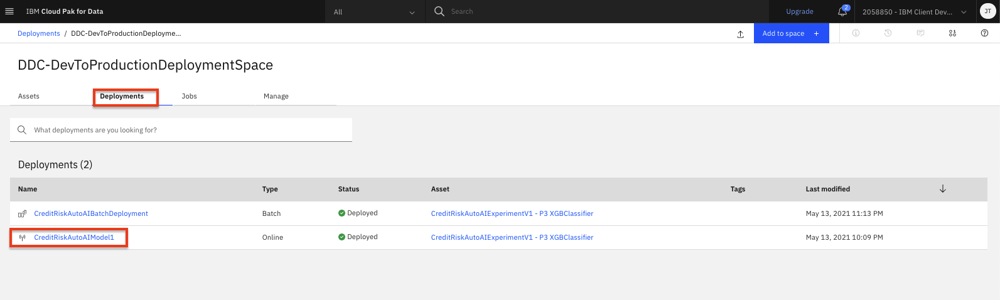
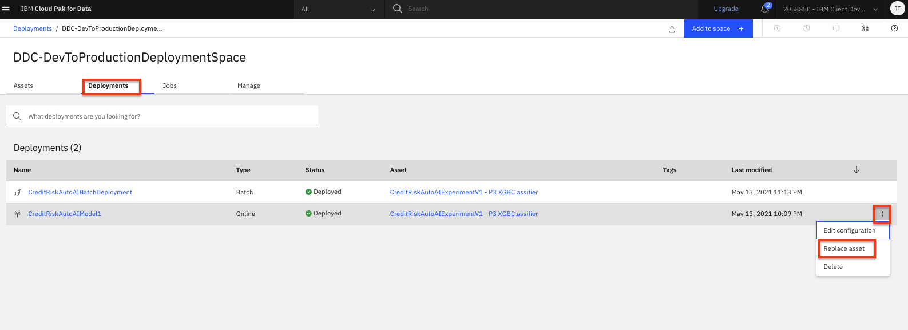
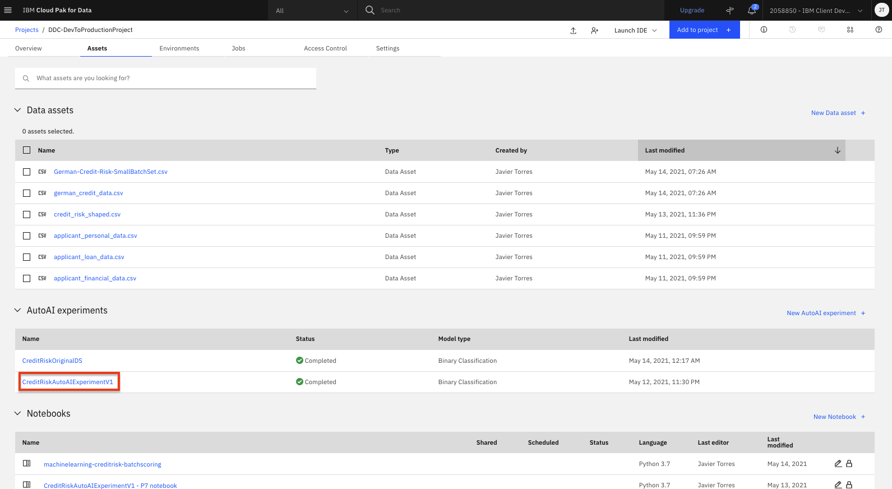
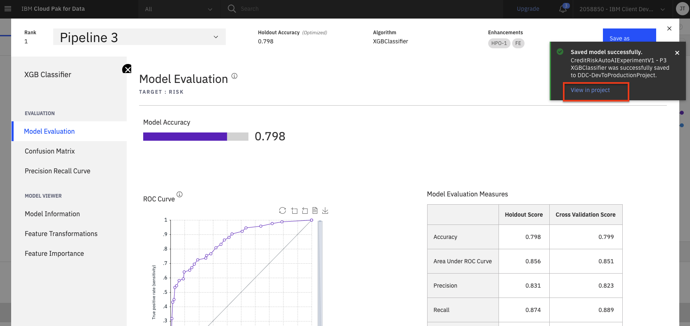
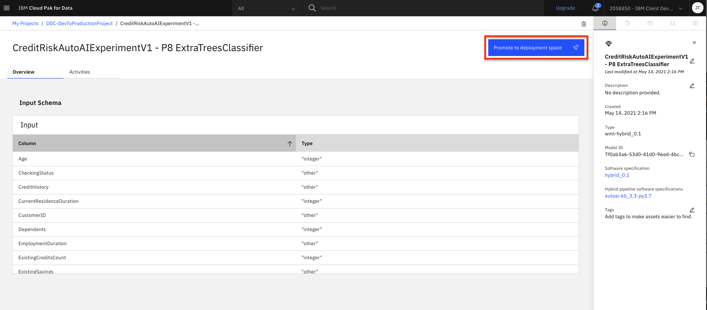

# Updating your models and deployments

In this module, we will explore how we can update a model or deployment once it has been released/created. Model operations and lifecycle management includes many different aspects that would need to be addressed, including, but not limited to: determining when a model needs to be replaced, testing models, comparing model performance, deployment testing (for example canary testing), and much more. In this lab we will focus just on the capabilities to update the model or the deployment, not on the methodology or testing approach.

> **Note:** You can click on any image in the instructions below to zoom in and see more details. When you do that just click on your browser's back button to return to the previous page.

> **Note:** The lab instructions below assume you have completed the [Machine Learning with AutoAI labs](../ml-model-development-autoai/running-autoai-experiment.md) and the [Model Deployment labs](../ml-model-deployment/online-model-deployment.md). You should have already created a model, promoted it to a deployment space and created an online deployment which is what we will update in this lab. If you run into an any issues, check the [FAQ section](../faq/README.md) for common resolutions*.

## Updating a Deployment

Once a deployment is created for a model, there may be consumers/clients of that model that depend on the endpoint to that deployment not changing. In this section we are going to update an existing deployment to use a new model asset (for example, when you have created a model with improved performance).

Its important to note that in order to update a deployment, the framework of the new model must be compatible with the existing deployed model. Also, the input schema for the new model must match the deployed model.

***Note: If you have completed both of the AutoAI Labs (1) model development with the UI and (2)running the generated Jupyter notebook), then you will have two models promoted in your deployment space and can proceed to the next section. If you have not completed the second lab, you can follow the [instructions at the bottom of this page](#extra-instructions:-save-and-promote-a-second-model) to save/promote a second pipeline.***

### Modify the Online Deployment

* Lets go to our deployment space to view our model assets and deployments. Navigate to the left-hand (☰) hamburger menu, expand the `Deployments` section and click on `View all spaces`.

    

* Choose the deployment space you setup previously by clicking on the name of your space. In the `Assets` tab you will see the models you promoted to this space.

* Lets check the deployment you created previously. Click on the `Deployment` tab and select the **online** deployment name you previously created.

    

* Notice in the deployment details the endpoint has an unique ID and the deployment is pointing to a specific model asset (in this case the Pipeline 3 model). Optionally, feel free to test the model by submitting a sample payload in the test panel as you did in the [model deployment lab](../ml-model-deployment/online-model-deployment.md#test-online-model-deployment).

    

* Go back to the deployment space overview by clicking on the deployment space name in the navigation breadcrumbs on the top left.

    

* Now, on the `Deployments` tab. Click on the three vertical dots to the right of your **online** deployment. Then select the `Replace asset` option from the menu.

    

* You can now select the asset that will replace the existing model for this deployment. Again, one thing to note is that you should only select an asset that is using a framework compatible with the existing deployed model and that the input schema exists and matches between the new and deployed model. Otherwise, the deployment may fail. Click the checkbox next to the second model you promoted to this space (in this case, Pipeline 8). Then click the `Replace` button.

    

* The deployment will be updated to use the replaced model. This may take a few minutes, during which time you will see the status set to `Updating`.

    

* Once the update completes, you will receive a notification that the deployment has been updated and the status will change to `Deployed`. To validate the update, click on the deployment name.

* Notice that the endpoint has not changed (the unique id is still the same) but the associated asset has been updated to our new model.

    

* Optionally, feel free to test the model by submitting a sample payload in the test panel as you did in the [model deployment lab](../ml-model-deployment/online-model-deployment.md#test-online-model-deployment). You may notice that the model makes a different prediction or have different scores from the previous model.

## Extra Instructions: Save and Promote a Second Model

These instructions are provided to help you deploy a second model from an existing AutoAI experiment. You only need to run them if you need a reminder on how to save and promote another pipeline from AutoAI, which you need to complete the lab above.

* To get started, we will need to identify the new model we want to use. Go the (☰) navigation menu, expand `Projects` and then click on your analytics project.

    

* Click on the completed AutoAI experiment you previously ran.

    

* Scroll down to see the `Pipeline leaderboard`. In this case, Pipeline 3 was the pipeline with the best result (on the cross validation set) for our experiment and the one we deployed during the previous lab. We will deploy a second pipeline using a different model algorithm. Click on the `Save as` button next for one of other pipelines. In this case, we are saving Pipeline 8.

    > *Note: The exact pipelines in your experiment may be different. The goal of this portion of the lab is to showcase how a deployment can be updated, so we can save any of the pipelines we have not previously promoted.*

    

* Choose the `Model` tile, accept the default name or change it if you like. Add optional description or tags, and click `Create`.

    

* You will see a notification to indicate that your model is saved to your project. Click the `View in project` link in the notification to go to the saved model. (*Alternatively, if you navigate back to your project assets tab by closing the pipeline and AutoAI experiment, you will see the saved model in the `Models` section, which you can click on to explore*).

    

* To make the model available to be deployed, we need to make it available in the deployment space you created during the setup module. Click on the `Promote to deployment space` button.

    

* Select the deployment space that was created as part of the setup module as the `Target space` and click `Promote`.

    

* You will be brought back to your project assets page and see a notification that the model was promoted to the deployment space succesfully. Feel free to close that notification.

## Conclusion

In this section we covered one approach to updating the deployment of a machine learning model. Although there are other aspects to managing and operating machine learning models in production, we have seen how to make changes to a model without impacting the model serving endpoint.
