# Workshop Setup

Before we get started with the workshop, you will need to download some assets and setup your environment.

This section is broken up into the following steps:

1. [Download Assets](#download-assets)
1. [Create IBM Cloud Account and IBM Cloud Pak for Data services](#create-ibm-cloud-account-and-service)
1. [Create a Project and Deployment Space](#create-a-project-and-deployment-space)
1. [Get the IBM Cloud platform API key](#get-api-access-details)
1. [Conclusion](#conclusion)

>**Note:** You can click on any image in the instructions below to zoom in and see more details. When you do that just click on your browser's back button to return to the previous page.

## Download Assets

Various parts of this workshop will require the attendee to upload files or run scripts. These artifacts have been collected in the following two zip files which you can download using the links below. For each line below, click on the `[Download]` link to get the file. If the link isn't working for you, try clicking the `[Mirror]` to get it from a backup server. You'll need these files in the next sections.

* Cloud Pak for Data Project - [[Download]](http://ibm.biz/ddc2021-cp4daas-project) | [[Mirror]](http://ibm.biz/ddc2021-cp4daas-project-mirror)
* Sample Python Application - [[Download]](http://ibm.biz/ddc2021-cp4daas-python-app) | [[Mirror]](http://ibm.biz/ddc2021-cp4daas-python-app-mirror)

## Create IBM Cloud Account and Services

We need to provision our Cloud Pak for Data as a Service instance. Cloud Pak for Data provides you with an integrated set of capabilities for collecting and organizing your data into a trusted, unified view, and then creating and scaling AI models across your business.

### Create Cloud Pak for Data Services

* Launch a new web browser window or tab and navigate to IBM Cloud Pak for Data using the region closest to your location from the list below:

    * [US, Dallas](https://dataplatform.cloud.ibm.com/registration/stepone?context=cpdaas&apps=all&regions=us-south&preselect_region=true)
    * [EU, Frankfurt](https://eu-de.dataplatform.cloud.ibm.com/registration/stepone?context=cpdaas&apps=all&regions=eu-de&preselect_region=true)
    * [Japan, Tokyo](https://jp-tok.dataplatform.cloud.ibm.com/registration/stepone?context=cpdaas&apps=all&regions=jp-tok&preselect_region=true)

* You can leave the pre-selected region or select the region nearest to you. Next, log in by doing one of the following:

    * If you do not have an IBMid, enter your email address on the left panel and accept the terms checkbox in the `Create a new IBM Cloud Account` section. Then click the `Next` button to complete the process of creating a new account.

    * If you already have and IBMid, click on the `Log in with your IBMid` link. Enter the requested profile information and then click the `Continue` button.

    > **Note:** If you are a returning user and you have watson services in a different region than the pre-selected one, you will see an error message telling you to select that region instead. See the [FAQ](../faq/README.md) section for help.

    [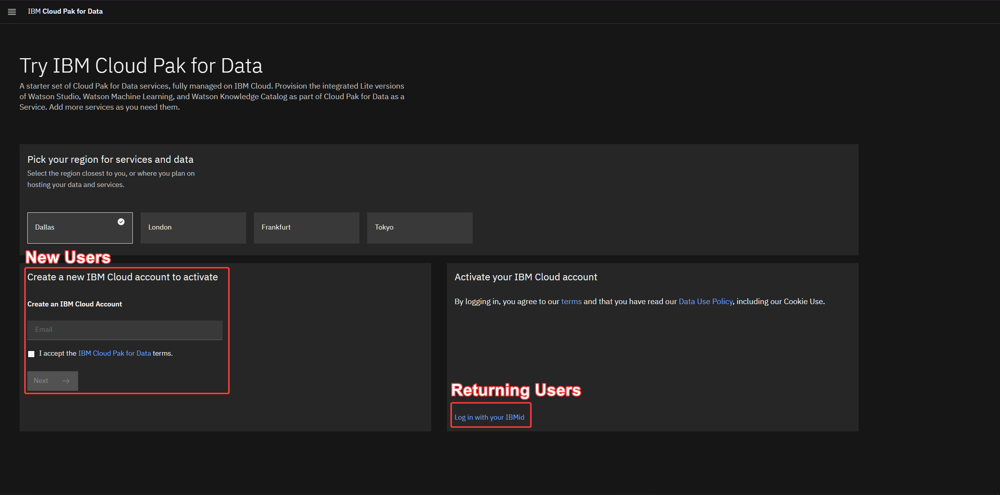](../images/setup/new-signup-page.png)

* The services required for IBM Cloud Pak for Data will be automatically provisioned for you. Once you see a message that says that the apps are ready to use, click on `Go to IBM Cloud Pak for Data`.

    [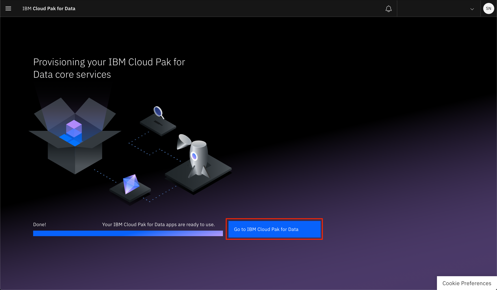](../images/setup/cpdaas-ready.png)

### Verify Service Instances

* Click on the (☰) navigation menu on the top left corner of the Cloud Pak for Data UI. Expand *`Services`* and then click on `Service instances`.

    [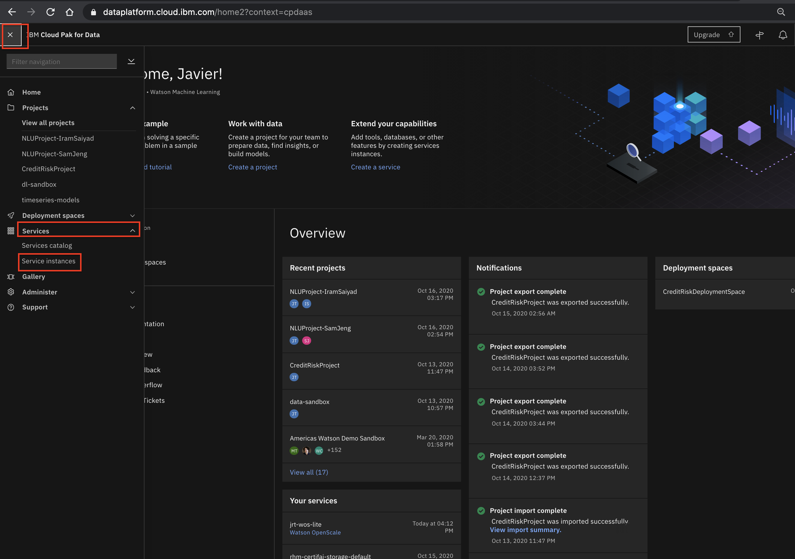](../images/navigation/menu-service-instances.png)

* If you see an instance of *Machine Learning*, take note of its name and you can skip to section [Create a Project and Deployment Space](#create-a-project-and-deployment-space).

* If you do not have an instance of *Machine Learning*, click on the `Add service +` button.

    [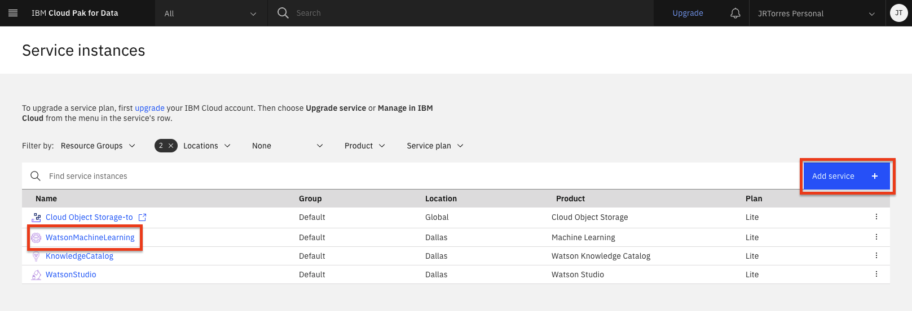](../images/setup/cpdaas-wml-instance-add.png)

* Search or scroll until you find the tile for *Machine Learning* and click on it.

    [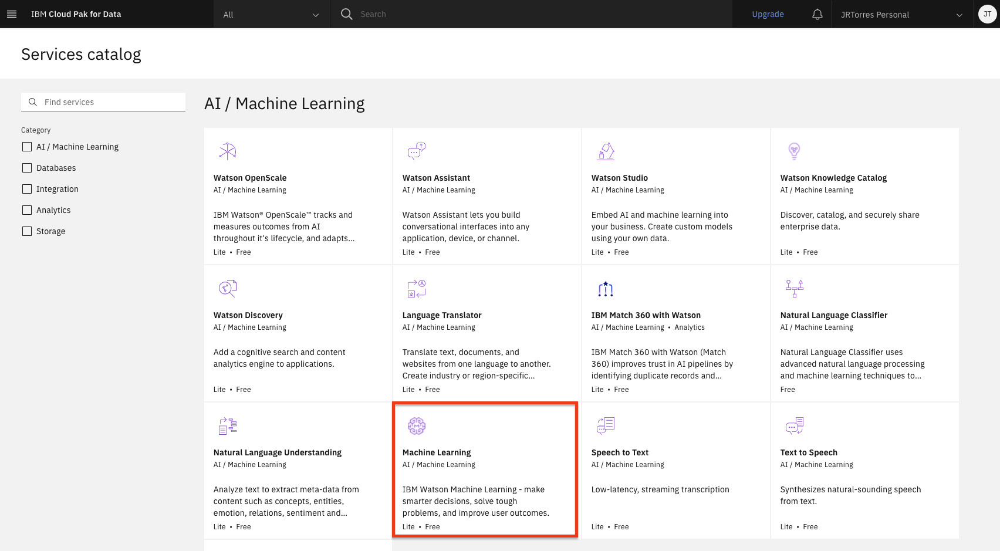](../images/setup/cpdaas-wml-tile.png)

* In the 'Select a region' drop down, choose the same region as you chose for your Cloud Pak for Data as a Service platform. Select the *Free* tier in the 'Pricing plan' section. Optionally, scroll down and change the name of the instance. Finally, click the `Create` button.

> **Note:** If you have any issues creating the services, please see the [FAQ](../faq/README.md) section for help.

## Create a Project and Deployment Space

### Import the Project

In Cloud Pak for Data, we use the concept of a project to collect / organize the resources used to achieve a particular goal (resources to build a solution to a problem). Your project resources can include data, collaborators, and analytic assets like notebooks and models, etc.

* Go the (☰) navigation menu, expand *Projects* and click on the *View all projects* link.

    [](../images/navigation/menu-projects.png)

* Click on the `New project` button. If you have existing projects, your screen will look different, click on the `New +` option on the top right.

    [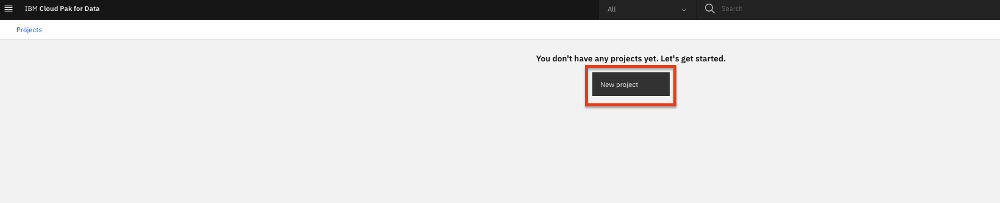](../images/setup/cpd-new-project.png)

* We are going to create a project from an existing file (which contains the assets we will use throughout this workshop), as opposed to creating an empty project. Select the _*Create a project from a sample or file*_ option.

    [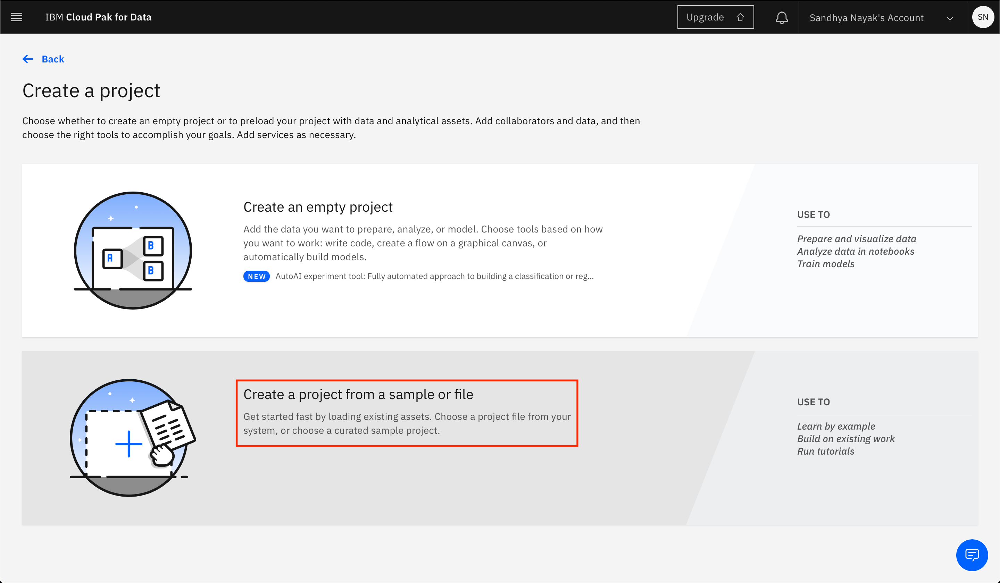](../images/setup/new-project-from-file.png)

* Click on the **browse** link and in the file browser popup, navigate to where you downloaded the files for this lab. Then select the `DDC2021-Course-DevToProductionProject.zip` file.

    [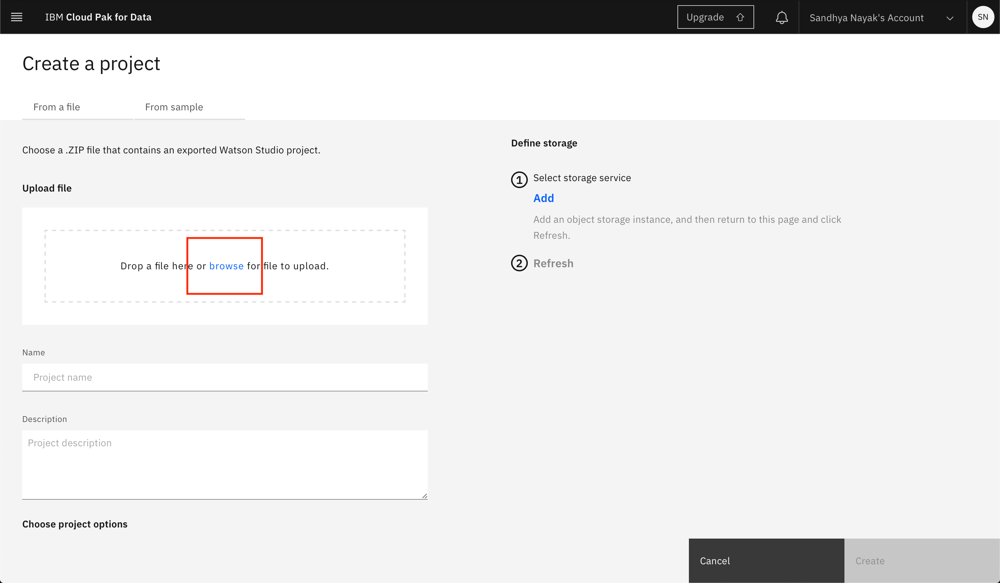](../images/setup/browse-project-zip.png)

* Give the project a name. If this is the first time you are creating a project and you do not have an IBM Cloud Object Storage (ICOS) service instance, you will see the **`Add`** link in the `Define Storage` section. If you already have a cloud object storage instance populated in this section, skip to the next step. Otherwise, provision an ICOS instance:

    * Go ahead and click on the `Add` link to create an instance (if you already have an object storage displayed, proceed to the next step).

        [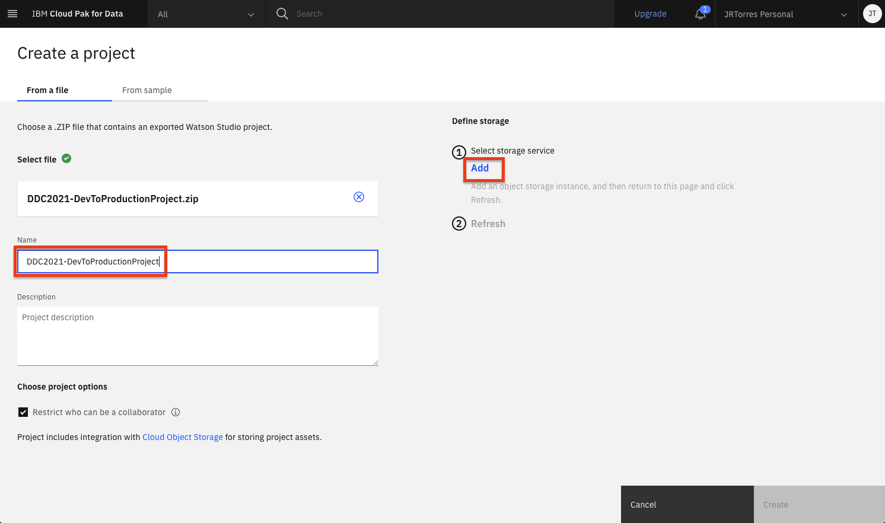](../images/setup/project-import-name.png)

    * A new browser tab will open up, where you can create the Cloud Object Service. By default, a `Lite` (Free) plan will be selected. Scroll down and update the name of your Cloud Object Storage service if you wish, and click `Create`.

        [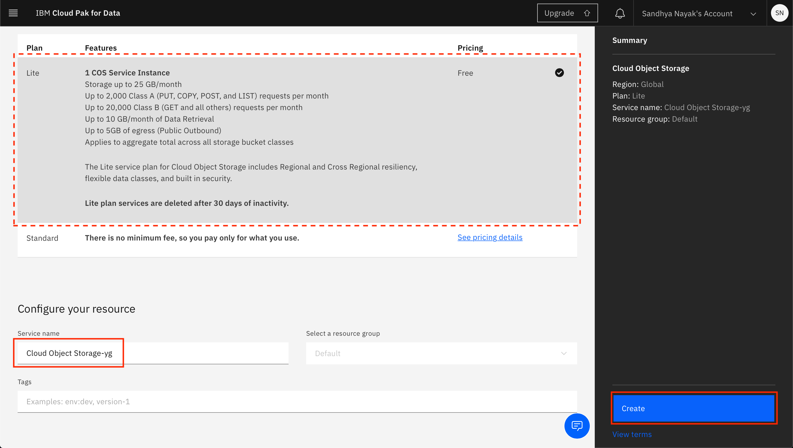](../images/setup/create-cos-instance.png)

    * The browser tab will automatically close when the Cloud Object Storage instance has been created. Back on IBM Cloud Pak for Data as a Service, click `Refresh`.

        [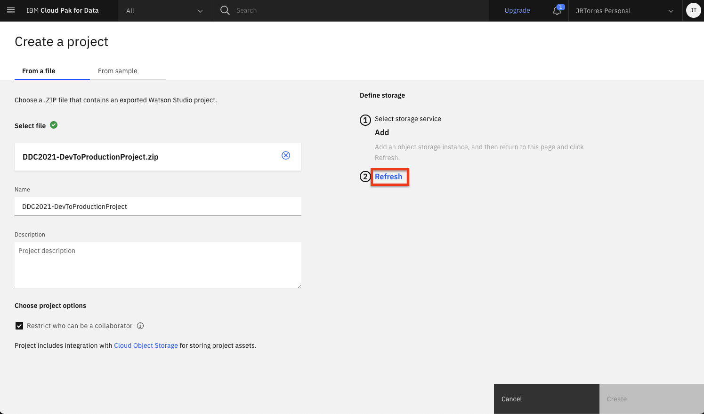](../images/setup/refresh-cos.png)

        > *Note: If you don't see the object storage instance, click the `Refresh` option again.*

* Your Cloud Object Storage instance will be displayed under "Storage". Click `Create` to finish creating the project.

    [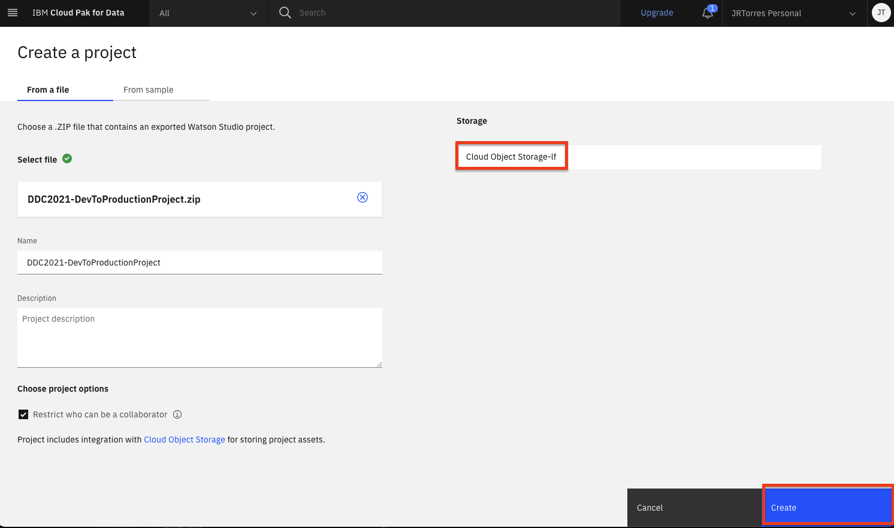](../images/setup/create-project.png)

* You can see a progress bar that says your project is being created. Once the project is succesfully created, on the pop up window click on the `View new project` button.

    [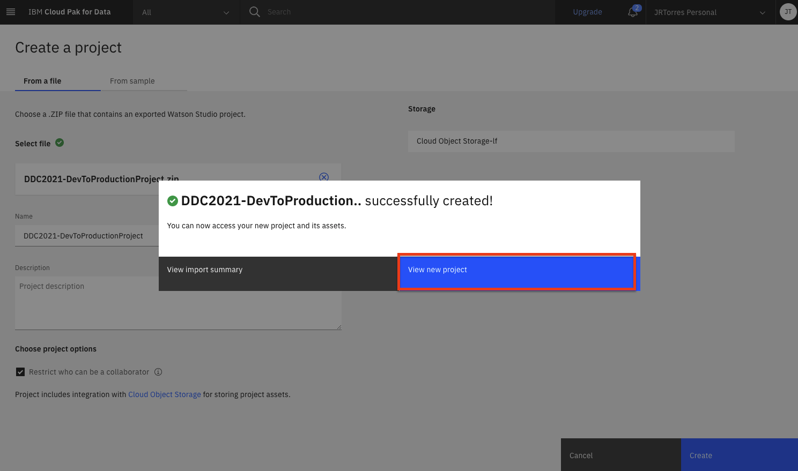](../images/setup/project-import-success.png)

* Clicking on the *Assets* tab will show all the assets that were imported into the project when it was created.

#### Associate a Watson Machine Learning Service instance to the project

You will need to associate a Watson Machine Learning service instance to your project in order to run Machine Learning experiments.

* Go to the *Settings* tab of your project and look for the *Associated services* section. Click on `Add service` and in the menu that opens up, click on `Watson`.

    [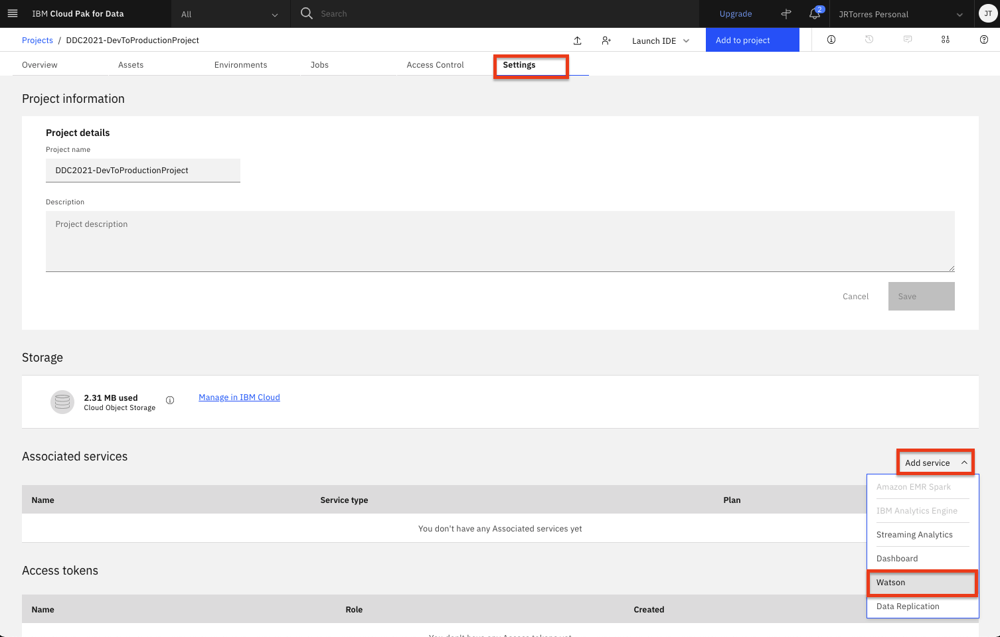](../images/setup/add-watson-service.png)

* Click the checkbox next to the Watson Machine Learning service instance that was created for you when you signed up for Cloud Pak for Data as a Service or the one you created in section 2. Click `Associate service`.

    > **Note:** If you have multiple WatsonMachineLearning services, make sure you select the one that is in the same regions as is your Cloud Pak for Data as a service.

    [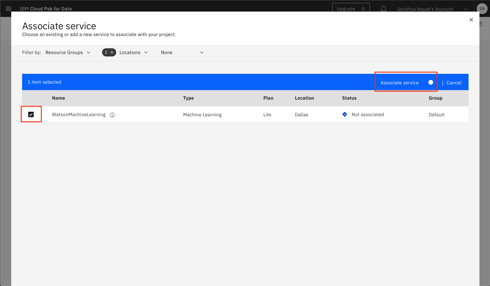](../images/setup/choose-wml-instance.png)

* You willsee a notification that the WatsonMachineLearning service was successfully associated with your project. Click on the `X` in the right top corner to close the pop up modal and go back to your project.

    [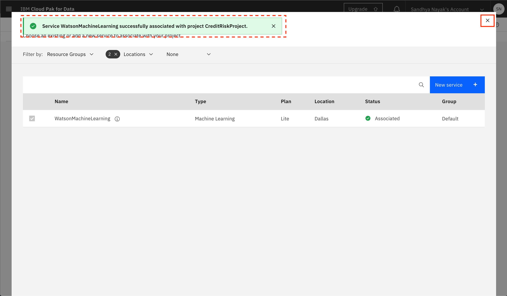](../images/setup/wml-service-added-successfully.png)

### Create a Deployment Space

Cloud Pak for Data uses the concept of `Deployment Spaces` to configure and manage the deployment of a set of related deployable assets. These assets can be data files, machine learning models, etc. For this workshop, we need to create one.

* Go the (☰) navigation menu, expand `Deployments` and then select `View all spaces`.

    [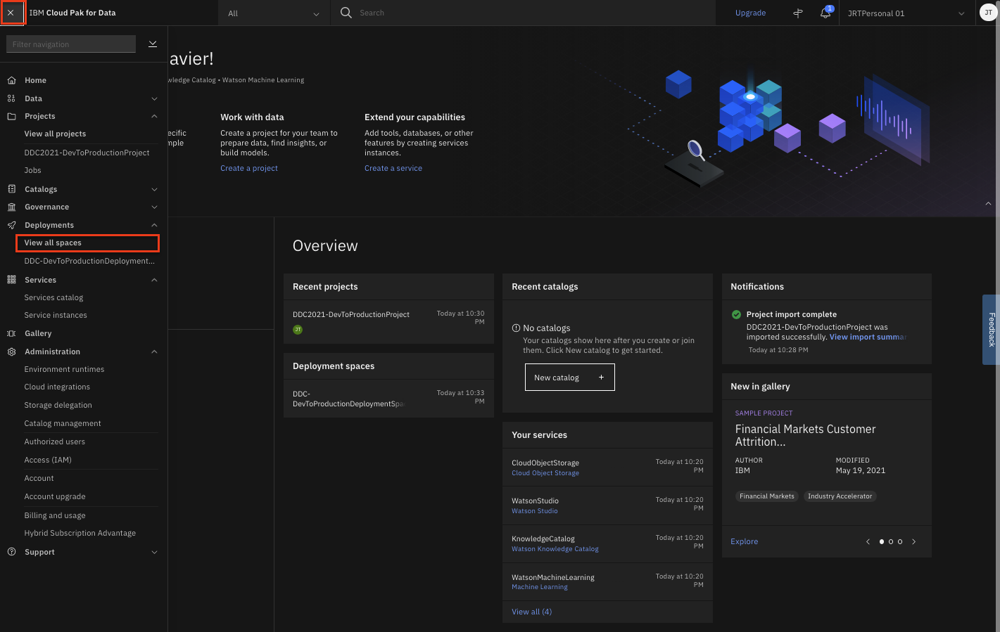](../images/navigation/menu-analytics-deployments.png)

* Click on the `New deployment space` button.

    [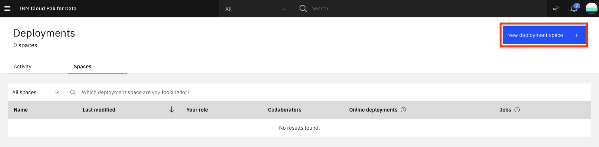](../images/setup/new-deployment-space.png)

* Give your deployment space a unique name and optional description. In the service drop downs, select the Cloud Object Storage instance that you had created when you were creating the project and select the Machine Learning Service instance associated with your IBM Cloud Pak for Data as a Service instance. Then click the `Create` button.

    [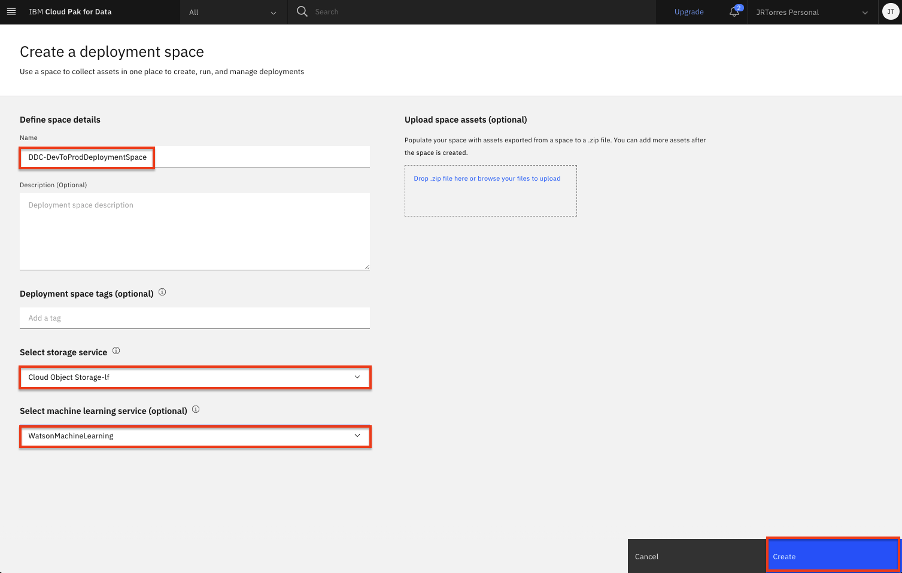](../images/setup/deployment-space-name.png)

* Once the deployment space is created, you can click on `View new space`.

    [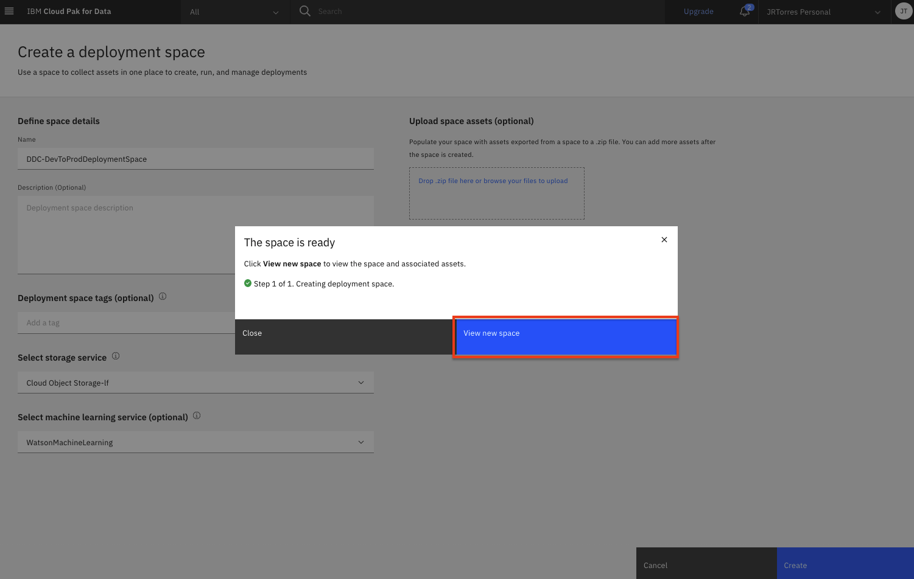](../images/setup/view-deployment-space.png)

## Get API Access Details

In some parts of this workshop, you will be using the Watson Machine Learning (WML) SDK / APIs to perform operations on your Watson Machine Learning instance. To programmatically access your Watson Machine Learning instance, you will need to provide the API key for your IBM Cloud account as well as the location of the WML service instance.

### Get an API Key

You will use the IBM Cloud Console to generate the IBM Cloud API key.

* In a new browser window or tab, open the [API keys section of the IBM Cloud console link](https://cloud.ibm.com/iam/apikeys).

* Select `My IBM Cloud API keys` in the *View* dropdown and then click `Create an IBM Cloud API key +`.

    [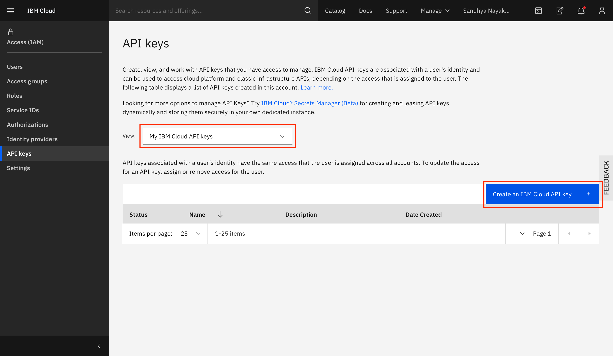](../images/setup/create-ibm-cloud-api-key.png)

* Give your API key a unique name and click `Create`. You should see a message that says `API key successfully created`. Click `Copy` to copy the generated API key and save it locally as you will need it in the workshop labs.

    [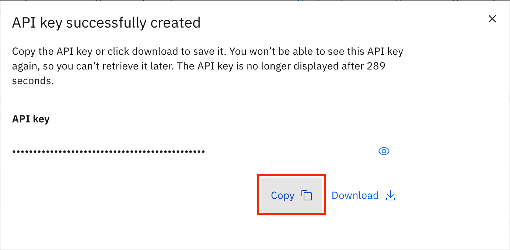](../images/setup/copy-api-key.png)

### Get the WML Service Instance Location

You will need to know the location (i.e region code) where your machine learning service instance is provisioned.

If you know the region where you provisioned the service, you can determine the region code from the table below:

| Region | Region Codes |
| :--- | :--- |
| Dallas | us-south |
| Tokyo | jp-tok |
| London | eu-gb |
| Frankfurt | eu-de |

If you are not sure of the region you provisioned, you can use the IBM Cloud CLI to obtain the location of the machine learning service instance.

* In a new browser window or tab, go to the [IBM Cloud Home Page](https://cloud.ibm.com) and click the terminal icon in the upper right-hand bar to launch a new cloud shell web terminal window.

    [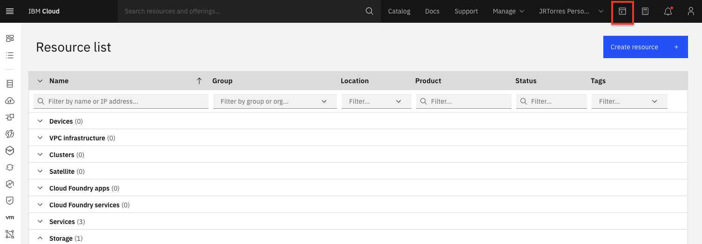](../images/setup/access-cloud-shell.png)

* Wait for the web terminal to be ready and then run the following command to retrieve information about the Machine Learning service instance. Remember to replace `<WML_INSTANCE_NAME>` with the name of your Machine Learning instance associated with your IBM Cloud Pak for Data as a Service instance.

    ```bash
    ibmcloud resource service-instance <WML_INSTANCE_NAME>
    ```

    > *Note: The `<WML_INSTANCE_NAME>` is the name of your machine learning instance name, which we saw in the ['Verify Service Instances'](#verify-service-instances) section above.*

* Get the value of `Location` from this result. This is the value that you will need to save for future labs.

## Conclusion

We have now completed creating an IBM Cloud account, a Cloud Pak for Data as a Service instance, and the project and deployment space that we will use in the rest of this workshop. We have also obtained the IBM Cloud API key that we will use to invoke APIs for your services.
