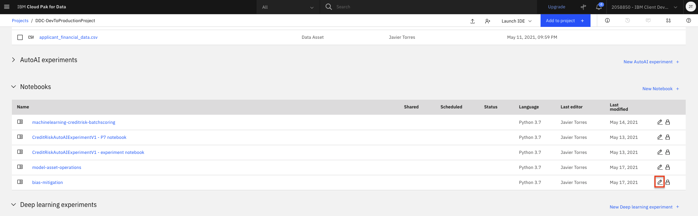
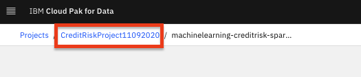
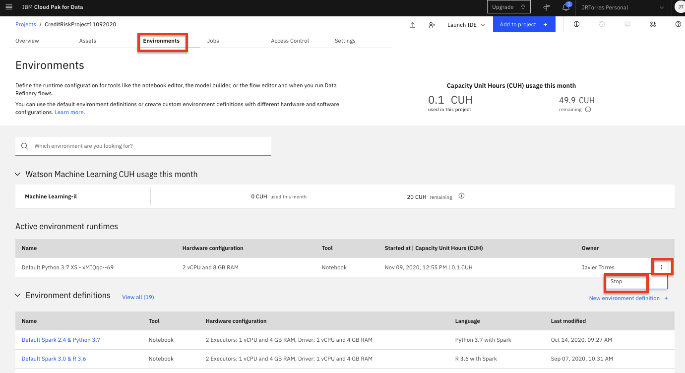
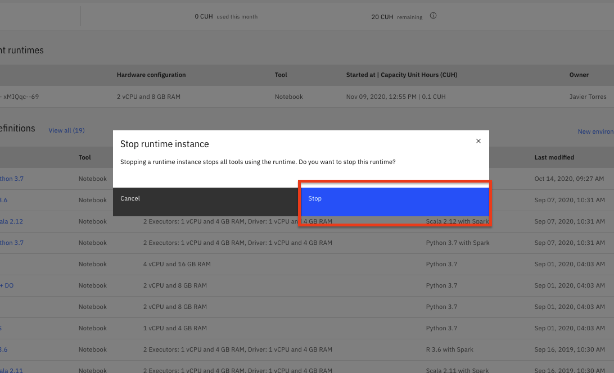

# Trusted AI - Fairness in Machine Learning

In this module, you will explore aspects of trust and transparency in AI. As machine learning models are built and used in production scenarios, it is essential that we can trust the output of these models/pipelines/systems. To build that trust we need a way to ensure the AI models/systems are reliable, that they are fair, that they are secure, that the predictions being made can be understood, and that they are robust. In this section, we look specifically at fairness in AI models (and the data used to build the models) to prevent bias. Bias in AI can occur when models give preferred outcomes to certain groups (inadvertently discriminating against race, or perpetuating gender bias, etc).

For the credit risk example used in the workshop, bias in the models can mean that certain populations of customers may be harmed or treated unfairly (i.e not receive loans). And the organizations using those models may be subject to legal and/or financial penalties. In the lab, we will be using the AI Fairness 360 (AIF360) Toolkit. AIF360 is an
extensible open source toolkit with over 70 fairness metrics and 10 state-of-the-art bias mitigation algorithm, which can be used to help examine and mitigate bias throughout the AI model/application lifecycle.

> **Note:** You can click on any image in the instructions below to zoom in and see more details. When you do that just click on your browser's back button to return to the previous page.

> **Note:** The lab instructions below assume you have completed the setup section already, if not, be sure to complete the setup first to create a project and a deployment space.

## Open Bias Exploration and Mitigation Notebook

We'll be using a Jupyter notebook in this lab which contains the code to load a dataset, then explore a small subset of the bias metrics and bias mitigation strategies from AIF360. The Jupyter notebook is already included as an asset in the project you imported during the setup module.

* Go the (☰) navigation menu, expand `Projects` and click on the project you created during the setup section.

    

* From your `Project` overview page, click on the `Assets` tab to open the assets page where your project assets are stored and organized.

* Scroll down to the `Notebooks` section of the page and click on the pencil icon at the right of the `bias-mitigation` notebook.

    

* When the Jupyter notebook is loaded and the kernel is ready, we will be ready to start executing it in the next section.

## Run Jupyter notebook

Spend some time looking through the sections of the notebook to get an overview. A notebook is composed of text (markdown or heading) cells and code cells. The markdown cells provide comments on what the code is designed to do.

You will run cells individually by highlighting each cell, then either click the `Run` button at the top of the notebook or hitting the keyboard short cut to run the cell (Shift + Enter but can vary based on platform). While the cell is running, an asterisk ([\*]) will show up to the left of the cell. When that cell has finished executing a sequential number will show up (i.e. [17]).

The notebook generated is pre filled with Python code and is divided into the following sections:

* **1.0 Definitions**: There are a number of definitions for bias. We will explore bias in the context of machine learning and specifically the bias that can cause unfairness in AI.

* **2.0 Setup**: This section installs the necessary packages and libraries to run the AIF360 toolkit and imports the specifc metrics / algorithims we will explore.

    * After the libraries are installed, you should restart the Jupyter kernel. Click on `Kernel` menu at the top of the page and select the `Restart` option from the menu.

* **3.0 Load and Explore Data**: This section of cells will import the German Credit risk dataset we have been using through the other modules. In this lab, we are using the dataset directly from the toolkit to save some time since it is already in the format expected by the metrics and mitigation algorithms.

* **4.0 Exploring Bias with AIF360**: With the data loaded, we can start to explore bias for both the specific dataset and the machine learning model we aim to build from the data. For this dataset, we know bias can occur based on age or gender. The notebook will focus on the age attribute and explore the following (very small subset of bias metrics):

    * Dataset: Given its ultimately a binary target in the training data, we explore bias for the training and test data using the `Binary Label Dataset` metric. We should see there is some disparate impact in the dataset based on age.

    * Model: We will build a simple ML model to highlight how we can also explore bias in the predictions made by a model. Ultimately, this is a classification model, so we will use the `Classification Metric`.

* **5.0 AI Fairness Algorithms**: Now that we know there is bias in our training data and the model, this final section in the notebook explores mitigation approaches. The notebook will only focus on the pre-processing algorithm. In specific, the notebook will look at the `Reweighing algorithm` which will transform the dataset to have more equity in positive outcomes on the protected attribute for the privileged and unprivileged groups.

## Stop the Environment

In order to conserve resources, make sure that you stop the environment used by your notebook(s) when you are done.

* Navigate back to your project information page by clicking on your project name from the navigation drill down on the top left of the page.

    

* Click on the 'Environments' tab near the top of the page. Then in the 'Active environment runtimes' section, you will see the environment used by your notebook (i.e the `Tool` value is `Notebook`). Click on the three vertical dots at the right of that row and select the `Stop` option from the menu.

    

* Click the `Stop` button on the subsequent pop up window.

    

## Conclusion

Congratulations. You've completed this lab and now have a basic understanding of how to install the AIF360 toolkit and some practical experience using a small subset of the toolkit to calculate bias and mitigate it.

**Additional Resources / References:**

There are lots of resources to continue exploring Trust in AI. To start, consider exploring some of the links below:

* [IBM Research - Fairness](https://www.research.ibm.com/artificial-intelligence/publications/paper/?id=AI-Fairness-360:-An-Extensible-Toolkit-for-Detecting,-Understanding,-and-Mitigating-Unwanted-Algorithmic-Bias)
* [IBM Developer Center for Open Source Data and AI Technologies - Trusted AI](https://www.ibm.com/opensource/centers/codait/trusted-ai/)
* [Sample Notebook using AIF360 and AutoAI](https://github.com/IBM/watson-machine-learning-samples/blob/master/cloud/notebooks/python_sdk/experiments/autoai/Use%20Lale%20AIF360%20scorers%20to%20calculate%20and%20mitigate%20bias%20for%20credit%20risk%20AutoAI%20model.ipynb)
